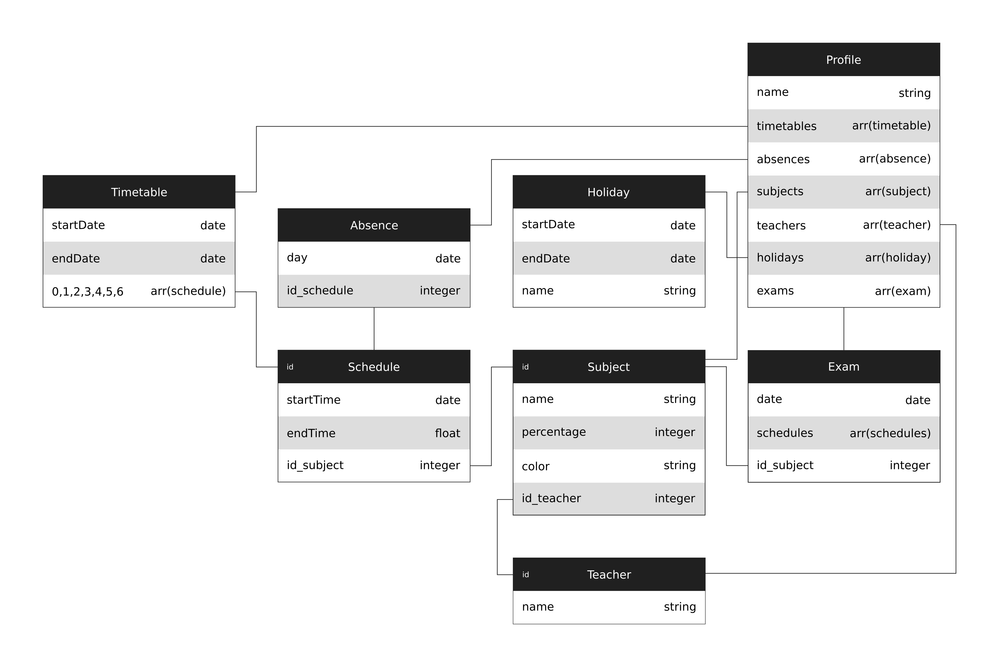
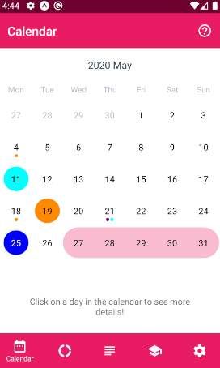
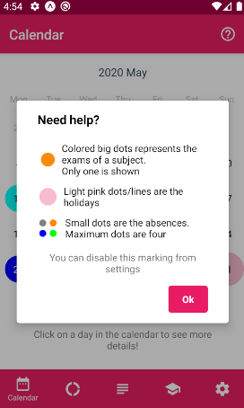
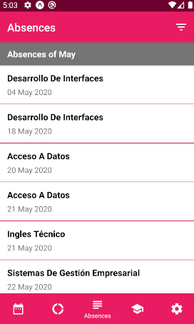
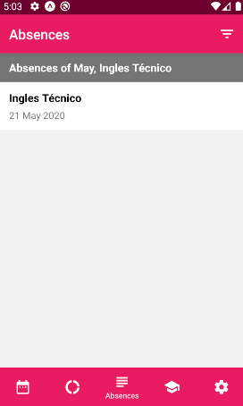
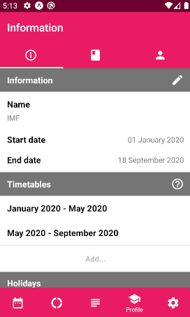

# ANALISIS Y PROTOTIPO 1

| Documento 	|   |
|-----------	|-  |
| Fecha     	| 18/04/2020  |
| Versión   	| 0.0.1 |
| Autor     	| Jorge Chércoles Moreno  |

<br>

| Proyecto      |  |
|-------------	|- |
| Título        | Aplicación de control de asistencias  |
| Descripción   | Aplicación de control de personal de las ausencias a tus diferentes cursos  |

**Recursos**

Pulsa en las imagenes para acceder a mis zonas de trabajo

<span style="margin: 0 20px;">[](https://github.com/Chiefbark/TFG)</span>
<span style="margin: 0 20px;">[](https://www.figma.com/file/QYLYZSbAeCGLE2cEa1kam3/designs)</span>
<span style="margin: 0 20px;">[](https://trello.com/b/umjDqcx3/tfg)</span>

<br>

<div style="page-break-after: always;"></div>

**Tabla de contenidos**
- [ANALISIS Y PROTOTIPO 1](#analisis-y-prototipo-1)
	- [INTRODUCCION](#introduccion)
	- [DIAGRAMA ENTIDAD-RELACION](#diagrama-entidad-relacion)
	- [DIAGRAMA CLASES](#diagrama-clases)
	- [DIAGRAMA DESPLIEGUE](#diagrama-despliegue)
	- [VISTAS](#vistas)
		- [CALENDARIO](#calendario)
		- [ESTADISTICAS](#estadisticas)
		- [AUSENCIAS](#ausencias)
		- [PERFIL](#perfil)
		- [AJUSTES](#ajustes)
	- [CONTRIBUIDORES](#contribuidores)

<div style="page-break-after: always;"></div>

## INTRODUCCION

En este documento se van a incluir los diferentes diagramas UML, así como el diseño de las vistas de la aplicación, realizados en la primera fase de análisis del proyecto.

Se explicará detalladamente cada componente del diagrama, así como su utilidad.

**Programas utilizados**

El programa utilizado para diseñar los diagramas fue [Inkscape](https://inkscape.org/es/), un programa vectorial gratuito que aún está en desarrollo.

Para realizar el diseño de las vistas se utilizó la plataforma online de [Figma](https://www.figma.com/). Esta herramienta te permite crear mock-ups para cualquier plataforma rápidamente gracias a su diseño orientado a componentes.

**Metodología aplicada**

Para realizar esta parte de la memoria se ha aplicado una metodología de prototipado, por lo que es posible que algunos diseños cambien a lo largo del tiempo.

<div style="page-break-after: always;"></div>

## DIAGRAMA ENTIDAD-RELACION


Este diagrama representa la relación que existe entre todas las entidades que componen la aplicación.

**Profile**

La aplicación funciona mediante perfiles. Estos perfiles tienen información acerca de los profesores del curso, sus asignaturas, exámenes, etc.

Todo ello se puede configurar desde la aplicación como veremos más adelante en las [vistas](#vistas).

**Timetable**

*Timetable* representa el horario semanal del curso. En principio sólo debería haber uno, pero se pueden crear más si se necesitase (posible cambio de horario a mitad de curso).

Se puede ver que tiene una relación de 1-N con *Schedule*. Eso significa que un *Timetable*, puede tener más de un *Schedule*, pero no al revés.

**Schedule**

Un *Schedule* es una clase concreta, por lo que necesitará tener una asignatura asociada, motivo por el cual tiene una relación con *Subject*.

También tiene una relación 1-N con *Absence*. El motivo de esta relación es que las faltas de asistencia tienen que estar asociadas a alguna clase concreta.

**Absence**

Representa una falta de asistencia. Muchas faltas de asistencia pueden hacer referencia a la misma clase, ya que pueden ser faltas de asistencia entre diferentes meses.

<div style="page-break-after: always;"></div>

**Subject**

Desde *Subject* (asignatura), podemos ver que tiene 3 relaciones
- *Schedule* : una asignatura puede estar en mas de un *schedule*, ya que es probable que tengas la misma asignatura en diferentes días de la semana.
- *Teacher* : las asignturas son impartidas por un profesor.
- *Exam* : los exámenes son de asignaturas concretas.

**Teacher**

Un profesor puede impartir más de una asignatura, por lo que la relación con *Subject* es de 1-N.

**Exam**

Es bueno llevar un control de los exámenes, saber qué días son y de que asignatura. La aplicación permite añadir exámenes indicando de qué asignatura es.

**Holiday**

La aplicación también te permite añadir vacaciones a tu perfil, para que esos días no cuenten cuando se calculan las horas de clase.

<div style="page-break-after: always;"></div>

## DIAGRAMA CLASES



Este diagrama indica tanto las referencias entre las entidades que vimos en el [diagrama ER](#diagrama-entidad-relacion), como los datos necesarios de cada entidad. Vamos a ir uno a uno explicándolos. [Abajo de esta sección](#ejemplo) encontrareis un ejemplo de cómo se representarían los datos.

**Profile**

- *Name* : nombre del perfil
- *Timetables* : lista de todos los horarios del perfil
- *Absences* : lista de todas las faltas de asistencia
- *Subjects* : lista de todas las asignaturas
- *Teachers* : lista de todos los profesores
- *Holidays* : lista de todas las vacaciones
- *Exams* : lista de todos los exámenes

**Timetable**

- *startDate* : la fecha de inicio del horario (*`yyyy-MM-dd`*)
- *endDate* : la fecha de finalización del horario (*`yyyy-MM-dd`*)
- *0,1,2,3,4,5,6* : indican los días de la semana, donde se guardarán listas de clases (schedule)

<div style="page-break-after: always;"></div>

**Schedule**

- *startTime* : la hora a la que empieza la clase (*`HH:mm`*)
- *endTime* : la hora a la que acaba la clase (*`HH:mm`*)
- *id_subject* : id que referencia a la asignatura que se imparte en esa hora

**Absence**

- *day* : fecha de la falta de asistencia (*`yyyy-MM-dd`*)
- *id_schedule* : id que referencia a la clase concreta en la que se faltó

**Subject**

- *name* : el nombre de la asignatura
- *percentage* : porcentaje sobre el cual se avisará al usuario. Este campo se utiliza para notificar al usuario si el número de faltas en esta asignatura es próximo a este valor
- *color* : color que tendrá la asignatura en el calendario ([vistas - calendario imagen 1](#calendario))
- *id_teacher* : id que referencia al profesor que imparte esa asignatura

Los colores serán 16 y serán fijos:
|	|	|	|	|	|	|	|	|
|:-:|:-:|:-:|:-:|:-:|:-:|:-:|:-:|
|		|	#080808	|		|	#808080	|		|	#FF6F6F	|		|	#800000	|
|		|	#FF0000	|		|	#808000	|		|	#FF8A00	|		|	#008000	|
|		|	#00FF00	|		|	#008080	|		|	#00FFFF	|		|	#000080	|
|		|	#0000FF	|		|	#800080	|		|	#FF00FF	|		|	#8844FF	|

**Teacher**

- *name* : nombre del profesor

**Exam**

- *date* : fecha en la que es el examen (*`yyyy-MM-dd`*)
- *schedules* : lista de todos las clases que ocupa el examen
- *id_subject* : id que referencia a la asignatura del examen

**Holiday**

- *startDate* : fecha de inicio de las vacaciones (*`yyyy-MM-dd`*)
- *endDate* : fecha de fin de las vacaciones (*`yyyy-MM-dd`*). Si el campo está vacío, significa que las vacaciones solo duran un día
- *name* : nombre de las vacaciones

<div style="page-break-after: always;"></div>

## DIAGRAMA DESPLIEGUE


En el diagrama de despligue se representan todos los servicios que se van a utilizar en la aplicación. En este caso se utilizan 3 servicios diferentes,

**APP**

Es la aplicación en sí. Esta formada por cuatro capas que permiten ver cómo funciona e interactúa con los demás servicios.

- *User interface* : es la interfaz con la que interactúa el usuario ([ver más en vistas](#vistas))
- *Logic layer* : es la capa que permite que la aplicación funcione. Sirve para dar sentido a las interacciones del usuario con la interfaz y proveerle de datos
- *Database interface* : se encarga de conectar la aplicación con la base de datos, permitiendo establecer una comunicación entre ambas

**DB**

La aplicación necesita una base de datos remota. La base de datos elegida ha sido [Firebase](https://firebase.google.com/?hl=es). Firebase es un servicio de Google que nos permite tener diferentes productos dependiendo de nuestras necesidades. Una de ellas es una base de datos documental, basada en documentos `JSON`. La aplicación sólo utilizará este servicio de firebase, aunque hay más a nuestra disposición.

<div style="page-break-after: always;"></div>

**API**

La aplicación utiliza la api [push notification tool de Expo](https://expo.io/notifications). Esta api permite que las aplicaciones creadas utilizando Expo (framework de React Native) puedan recibir notificaciones. Para ello utiliza un Token único generado automaticamente cuando la aplicación se instala en un dispositivo, y mediante un `fetch` a la uri `https://exp.host/--/api/v2/push/send` enviando distintos parámetros, le pueden llegar notificaciones al dispoisitivo del usuario. Este es un ejemplo de cómo se implementaría

```
const token = await Notifications.getExpoPushTokenAsync();
fetch('https://exp.host/--/api/v2/push/send', {
	method: 'POST',
	headers: {
		Accept: 'application/json',
		'Content-Type': 'application/json'
	},
	body: JSON.stringify({
		to: token,
		title: 'New Notification',
		body: 'The notification worked!',
		sound: 'default'
	})
})
.then(response => response.json())
.then(responseJson => {})
.catch(error => {
	console.log(error);
});
```

**Firebase CLOUD FUNCTIONS**

Firebase facilita un sistema para ejecutar funciones como código back-end para tus aplicaciones. He utilizado este sistema para crear dos funciones programadas para ejecutarse cada día a las 19:00 hora española:
- `ExamFunction` : comprueba por cada usuario si al día siguiente tiene algún examen, en cuyo caso llama a la API de Expo para mandar una notificación avisándoles de los exámenes.
- `AbsenceFunction` : comprueba por cada usuario el porcentaje de faltas de cada asignatura para ver si al día siguiente es posible que supere el porcentaje estabecido. Si se da el caso, llama a la API de Expo para mandar una notificación avisándoles sobre la asignatura.

<div style="page-break-after: always;"></div>

## VISTAS

Los diseños de las vistas fueron creados con Figma. [Aquí](https://www.figma.com/file/QYLYZSbAeCGLE2cEa1kam3/designs?node-id=0%3A1&viewport=347%2C247%2C0.09946409612894058) está el link para ver el proyecto. Si le dan al botón de *play* (arriba a la derecha), accederán a una vista navegable de la aplicación.

La información de los diseños es la misma que la expuesta en el [ejemplo anterior](#ejemplo).

La aplicación consta de 5 pantallas principales, cada una representada con un icono diferente


### CALENDARIO

|		|		|		|
|:-:|:-:|:-:|
|	1	|	2	|	3	|

En la **imagen 1** podemos encontrar un calendario por el que podremos desplazarnos libremente. Pulsando sobre un día conceto del calendario podremos ver que nos salta un diálogo (**imagen 2**) donde nos muestra las asignaturas que hay ese día, con su profesor y un botón a su derecha que indica si hemos faltado o no a la clase. En el caso de que haya un examen, también aparecería.

Si nos fijamos, en la **imagen 1** hay diferentes circulos con distintos colores. Si pulsamos sobre el botón de `ayuda` nos mostrará otro diálogo donde podremos ver qué significa cada uno (**imagen 3**).

Como podemos ver, los puntitos pequeños son las faltas de asistencia que tenemos ese día (las especificadas en la **imagen 2**). Cada color representa una asignatura utilizando el campo *color* que habíamos especificado en  [*subject* - diagrama de clases](#diagrama-clases).
<br>
Los exámenes se muestran con un círculo del color de la asignatura y el color rosa representa los días de vacaciones que se han establecido. Esta información se puede ocultar desde la pantalla de [ajustes (imagen 1)](#ajustes).

<div style="page-break-after: always;"></div>

### ESTADISTICAS

|		|		|		|
|:-:|:-:|:-:|
|	1	|	2	|	|

En la **imagen 1** de estadísticas podemos ver un listado de todas las asignaturas junto con el porcentaje de faltas de asistencia. El color del mensaje de faltas de asistencia será amarillo si el usuario está cerca de llegar al porcentaje establecido en  [*subject* - diagrama de clases](#diagrama-clases), o rojo si está muy cerca o se ha pasado.

Si pulsamos sobre el botón de `filtrar` nos mostrará un diálogo para aplicar un filtro. Los valores posibles son:
- *Asignaturas* : se mostrarán las faltas de asistencia agrupadas por asignaturas (como la **imagen 1**)
- *Profesores* :se mostrarán las faltas de asistencia agrupadas por profesores

Por defecto aparecerá el filtro por asignaturas cuando se habra esta pantalla.

A la derecha de cada elemento podremos ver cuáles son las faltas de asistencia (botón `ver faltas...`). Nos llevará a la pantalla de [Ausencias (imagen 3)](#ausencias).

<div style="page-break-after: always;"></div>

### AUSENCIAS

|		|		|	 |
|:-:|:-:|:-:|
|	1	|	2	|	3	|

La **imagen 1** muestra el filtro de faltas de asistencias del mes actual. Esta será la vista por defecto. Aquí se mostrarán todas las faltas de asistencia que el usuario ha tenido en el mes.

Si le damos al botón `filtrar` nos mostrará un formulario (**imagen 2**) donde podremos elegir el mes que queremos mostrar y/o la asignatura.
- Si dejamos el mes vacío, se cargarán todas las faltas de asistencia de la asignatura seleccionada
- Si dejamos la asignatura vacía, se cargarán todas las faltas de asistencia de el mes seleccionado
- Si dejamos ambos campos vacío, se cargará por defecto las faltas de asistencia de todas las asignaturas de el mes actual

Por ejemplo, aplicando el filtro de
- *Mes*: vacío
- *Asignatura*: Acceso a datos

nos mostrará todas las faltas de asistencia de acceso a datos (**imagen 3**). Este filtro es el resultado de pulsar el botón `ver faltas...` en la pantalla [Estadísticas (imagen 1)](#estadisticas).

<div style="page-break-after: always;"></div>

### PERFIL

Esta pantalla tiene todas las configuraciones del perfil: información, vacaciones, exámenes y horarios.

Arriba podemos encontrar una barra de navegación para cambiar entre
- Configuración del perfil
- Asignaturas
- Profesores


#### INFORMACION DEL PERFIL

|		|		|		|
|:-:|:-:|:-:|
|	1a	|	1b	|	|

Por defecto la **imagen 1** es la principal. Aquí podemos ver distintas secciones:
- Información
- Horarios
- Vacaciones y eventos
- Exámenes

**Información**

Es la información básica del perfil, como su nombre y la fechad e inicio y fin. Estas fechas corresponden con la fecha incial del primer horario y la fecha final del último.
<br>
Si pulsas sobre el icono de editar te saldrá un diálogo para cambiar el nombre del perfil.

<div style="page-break-after: always;"></div>

**Horarios**

|		|		|		|
|:-:|:-:|:-:|
|	2	|	3	|	4	|


Aquí se muestran los horarios creados del perfil. Pulsando sobre el botón `ayuda` se mostrará un diálogo (**imagen 2**) donde vendrá una breve explicación de qué significa esta sección.

Por lo general sólo se tendrá creado uno, pero siempre se pueden crear más si se requiriera pulsando sobre `Añadir...`.

Cuando se quiere añadir un nuevo horario al perfil, aparece la **imagen 3** en la pantalla. Aquí se muestra una barra de navegación que corresponde con los días de la semana. En cada uno de ellos encontrarás todas las clases que hay ese día.

Para añadir una nueva clase, pulsamos sobre el botón flotante `añadir`. Esto nos lelva a la **imagen 4**, un formulario donde podremos crear la nueva clase para nuestro horario.
<br>
Si queremos editar podemos mantener pulsada la clase en cuestión.

Los campos del formulario están especificados en [*schedule* - diagrama de clases](#diagrama-clases).

<div style="page-break-after: always;"></div>

**Vacaciones/eventos y exámenes**

|		|		|		|		|
|:-:|:-:|:-:|:-:|
|	5	|	6	|	7	|	8	|

Pulsando sobre el botón `ayuda` se mostrará un diálogo (**imagen 5 y 6**) donde vendrá una breve explicación de qué significa cada sección.

Para añadir un dato nuevo a alguno de estas secciones, pulsaremos sobre el botón `Añadir...` de la sección específica. Esto nos mostrará el formulario (**imagen 7 y 8**) de la sección donde podremos rellenar los datos para crear un nuevo elemento.

Los campos de los formularios están especificados en [Holiday/Exam - diagrama de clases ](#diagrama-clases).

<div style="page-break-after: always;"></div>

#### ASIGNATURAS

|		|		|		|
|:-:|:-:|:-:|
|	1a	|	1b	|	2	|

Cuando accedamos a la pestaña de asignaturas, aparecerán todas las asignaturas del perfil (**imagen 1**).

Para añadir una nueva pulsaremos sobre el botón flotante `añadir`. Esto mostrará un formulario (**imagen 2**) donde podremos rellenar los datos para crearla.
<br>
Para editar una asignatura hay que mantener pulsado el elemento.

Los campos del formulario están espeficados en [*subject - diagrama de clases*](#diagrama-clases).

<div style="page-break-after: always;"></div>

#### PROFESORES

|		|		|		|
|:-:|:-:|:-:|
|	1a	|	1b	|	2	|

Cuando accedamos a la pestaña de profesores, aparecerán todos los profesores del perfil (**imagen 1**).

Para añadir uno nuevo pulsaremos sobre el botón flotante `añadir`. Esto mostrará un formulario (**imagen 2**) donde podremos rellenar los datos para crearlo.
<br>
Para editar un profesor hay que mantener pulsado el elemento.

Los campos del formulario están espeficados en [*teacher - diagrama de clases*](#diagrama-clases).

<div style="page-break-after: always;"></div>

### AJUSTES

|		|		|		|
|:-:|:-:|:-:|
|	1	|	|	|

En esta pantalla se encuentra toda la configuración de la aplicación
- *Perfil* : aquí se puede ver el perfil que está seleccionado. También se puede cambiar de perfil o añadir otro desde el botón `Cambiar...`
- *Idioma* : se muestra el idioma de la aplicación seleccionado. Se puede cambiar desde el botón `Cambiar...`. La aplicación dispondrá de los idiomas Español e Inglés
- *Notificaciones* : configuración de las notificaciones. El usuario puede marcar o desmarcar qué notificaciones quiere que le llegen
- *Información del calendario* : la información mostrada en la pantalla de [Calendario (imagen 1)](#calendario) se puede configurar desde aquí, marcando o desmarcando la información que se quiera mostrar

<div style="page-break-after: always;"></div>

## CONTRIBUIDORES

| **Jorge Chércoles Moreno** |
| :-: |
|  |
| <a href="http://github.com/Chiefbark" target="_blank">`github.com/Chiefbark`</a> |