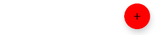
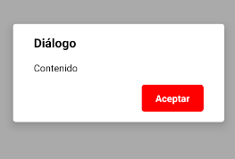
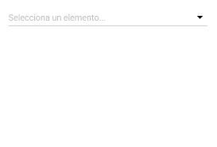
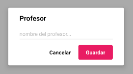
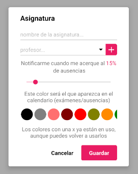
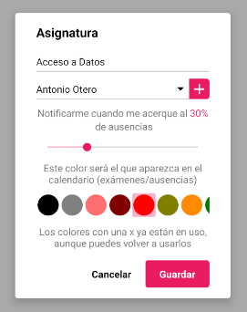

# ANALISIS Y PROTOTIPO 2

| Documento 	|   |
|-----------	|-  |
| Fecha     	| 27/04/2020  |
| Versión   	| 0.0.1 |
| Autor     	| Jorge Chércoles Moreno  |

<br>

| Proyecto      |  |
|-------------	|- |
| Título        | Aplicación de control de asistencias  |
| Descripción   | Aplicación de control de personal de las ausencias a tus diferentes cursos  |

**Recursos**

Pulsa en las imagenes para acceder a mis zonas de trabajo

<span style="margin: 0 20px;">[](https://github.com/Chiefbark/TFG)</span>
<span style="margin: 0 20px;">[](https://www.figma.com/file/QYLYZSbAeCGLE2cEa1kam3/designs)</span>
<span style="margin: 0 20px;">[](https://trello.com/b/umjDqcx3/tfg)</span>

<br>

<div style="page-break-after: always;"></div>

**Tabla de contenidos**
- [ANALISIS Y PROTOTIPO 2](#analisis-y-prototipo-2)
	- [INTRODUCCION](#introduccion)
	- [COMPONENTES](#componentes)
		- [BUTTON](#button)
		- [ICON](#icon)
		- [SWITCH](#switch)
		- [LIST HEADER](#list-header)
		- [LIST ITEM](#list-item)
		- [COLOR PICKER](#color-picker)
		- [DIALOG](#dialog)
		- [REACT NATIVE PICKER SELECT](#react-native-picker-select)
		- [PICKER](#picker)
		- [REACT NATIVE CALENDARS](#react-native-calendars)
		- [CALENDAR DAY](#calendar-day)
		- [CALENDAR PICKER](#calendar-picker)
	- [FORMULARIOS](#formularios)
		- [TEACHER FORM](#teacher-form)
		- [SUBJECT FORM](#subject-form)
	- [SISTEMAS IMPLEMENTADOS](#sistemas-implementados)
		- [I18N](#i18n)
		- [CONFIG](#config)
	- [CONTRIBUIDORES](#contribuidores)

<div style="page-break-after: always;"></div>

## INTRODUCCION

En este documento se van a explicar todos los componentes creados para la aplicación, así como los sistemas más importantes y su funcionamiento.

El lenguaje utilizado es `Javascript`, con el superconjunto de `ECMAScript 6`.
<br>
`ECMAScript 6` o `ES6` es un super conjunto de javascript que añade funcionalidade extra al lenguaje, como por ejemplo:
- `let` : variables de ámbito
- `const` : constantes
- `Arrow functions` : funciones anónimas
- `Classes` : orientación a componentes

[Aquí](https://ecma-international.org/ecma-262/10.0/index.html) puedes encontrar toda la información referente a ES6.

Para desarrollar el proyecto se utiliza `Expo`, un framework creado a partir de `React Native` que permite crear aplicaciones tanto para IOs como Android utilizando exclusivamente javascript. La documentación de este framework se encuentra [aquí](https://docs.expo.io/).

<div style="page-break-after: always;"></div>

## COMPONENTES

Los componentes utilizados, tanto propios como externos, para el desarrollo de la aplicación se van a exponer aquí. Los componentes externos tendrán el símbolo &#9432; indicando que son dependencias y pondrán los links para ver su documentación.

<div style="page-break-after: always;"></div>

### BUTTON

Este componente permite al usuario interactuar con un elemento en la pantalla.

```jsx
<Button label={'Aceptar'}
		backgroundColor={'#FF0000'}
		textColor={'#FFFFFF'}
		onClick={() => alert('botón pulsado')}
		onLongClick={() => alert('botón mantenido')}
		style={{paddingHorizontal: 50}}/>
```


**Propiedades**
-

**`label ( required )`**

Define el texto que va a tener el botón.
<br>
Recibe un `string`
```jsx
<Button label={'Aceptar'}/>
```


**`backgroundColor ( optional )`**

Define el color de fondo que va a tener el botón.
<br>
Recibe un color
```jsx
<Button label={'Aceptar'} backgroundColor={'#FF0000'}/>
```


<div style="page-break-after: always;"></div>

**`textColor ( optional )`**

Define el color del texto que va a tener el botón.
<br>
Recibe un `string`
```jsx
<Button label={'Aceptar'} textColor={'#FF0000'}/>
```


**`disabled ( optional )`**

Indica si el butón está deshabilitado o no.
<br>
Recibe un `bool`. Por defecto es valor es `false`

**`onClick ( optional )`**

Función llamada cuando el usuario pulsa el botón.
```jsx
<Button label={'Aceptar'} onClick={() => alert('botón pulsado')}/>
```

**`onLongClick ( optional )`**

Función llamada cuando el usuario mantiene pulsado el botón.
```jsx
<Button label={'Aceptar'} onLongClick={() => alert('botón mantenido')}/>
```

**`style ( optional )`**

Añade estilos directamente al componente.
<br>
Recibe un `View.style`
- No se pueden aplicar estilos al texto
- La propiedad `backgroundColor` tiene prioridad

<div style="page-break-after: always;"></div>

### ICON

Este componente permite al usuario interactuar con un icono en la pantalla.

```jsx
<Icon source={require('./assets/icons/icon_add.png')}
	  size={'large'}
	  iconColor={'#FFFFFF'}
	  style={{backgroundColor: '#FF0000'}}
	  onClick={() => alert('icono pulsado')}
	  onLongClick={() => alert('icono mantenido')}/>
```


**Propiedades**
-

**`source ( required )`**

Define el texto que va a tener el botón.
<br>
Recibe un `ImageSourcePropType`
```jsx
<Icon source={require('./assets/icons/icon_add.png')}/>
```


**`iconColor ( optional )`**

Define el color de la imagen que va a tener el icono.
<br>
Recibe un `string`
```jsx
<Icon source={require('./assets/icons/icon_add.png')} iconColor={'#FF0000'}/>
```


<div style="page-break-after: always;"></div>

**`size ( optional )`**

Define el tamaño que va a tener el icono.
<br>
Recibe un `string ['small', 'normal', 'large']`. Por defecto es valor es `normal`
```ts
<Button source={require('./assets/icons/icon_add.png')} size={'small'}/>
<Button source={require('./assets/icons/icon_add.png')} size={'large'}/>
```


**`floating ( optional )`**

Indica si el icono es flotante o no. El botón se colocará automáticamente en la esquina inferior izquierda y tendrá los bordes redondeados.
<br>
Lo ideal es combinar esta propiedad junto con la propiedad `style`, añadiendo un color de fondo.
<br>
Recibe un `bool`. Por defecto es valor es `false`
```jsx
<Icon source={require('./assets/icons/icon_add.png')}
	  floating={true}
	  style={{backgroundColor: '#FF0000'}}/>
```


**`visible ( optional )`**

Indica si el icono es visible o no.
<br>
Recibe un `bool`. Por defecto es valor es `true`

**`disabled ( optional )`**

Indica si el icono está deshabilitado o no.
<br>
Recibe un `bool`. Por defecto es valor es `false`

**`onClick ( optional )`**

Función llamada cuando el usuario pulsa el icono.
```jsx
<Icon source={require('./assets/icons/icon_add.png')}
	  onClick={() => alert('icono pulsado')}/>
```

<div style="page-break-after: always;"></div>

**`onLongClick ( optional )`**

Función llamada cuando el usuario mantiene pulsado el icono.
```jsx
<Icon source={require('./assets/icons/icon_add.png')}
	  onLongClick={() => alert('icono mantenido')}/>
```

**`style ( optional )`**

Añade estilos directamente al componente.
<br>
Recibe un `View.style`
- No se pueden aplicar estilos al icono
- Sobreescribir el `padding` del componente puede dar resultados inesperados si el icono es flotante. Utiliza `width` y `height` en su lugar

<div style="page-break-after: always;"></div>

### SWITCH

Este componente permite al usuario cambiar el estado de un botón.

```jsx
<Switch/>
```


**Propiedades**
-

**`initialValue ( optional )`**

Define el texto que va a tener el botón.
<br>
Recibe un `bool`. Por defecto es valor es `false`
```jsx
<Switch initialValue={true}/>
```


**`onChange ( optional )`**

Función llamada cuando el estado del botón cambia.
<br>
Recibe un parámetro `value : Bool` que indica el nuevo valor del componente
```jsx
<Icon onChange={(value) => alert('valor: '+ value)}/>
```

**`style ( optional )`**

Añade estilos directamente al componente.
<br>
Recibe un `View.style`
- No se puede cambiar el color del track del componente
- No se puede cambiar el color del círculo del componente

<div style="page-break-after: always;"></div>

### LIST HEADER

Este componente permite añadir elementos para mostrar diferente información y aplicar acciones al componente.

```jsx
<ListHeader label={'label'}
			textColor={'#000000'}
			rightItem={() => <Text style={{marginRight: 16}}>derecha</Text>}
			style={{backgroundColor: '#FF0000'}}/>
```


**Propiedades**
-

**`label ( required )`**

Define el título que va a tener el componente.
<br>
Recibe un `string`
```jsx
<ListHeader label={'label'}/>
```


**`textColor ( optional )`**

Define los estilos que va a tener el título del componente.
<br>
Recibe un `string`
```jsx
<ListHeader label={'label'} textColor={'#000000'}/>
```


<div style="page-break-after: always;"></div>

**`rightItem ( optional )`**

Renderiza un componente a la derecha del componente.
<br>
Recibe una `function` que devuelve un `component`
```jsx
<ListHeader label={'label'}
			rightItem={() => <Text style={{marginRight: 16}}>derecha</Text>}/>
```


**`style ( optional )`**

Añade estilos directamente al componente.
<br>
Recibe un `View.style`
- No se pueden cambiar los estilos del label
- No se pueden cambiar los estilos del elemento `rightItem`

<div style="page-break-after: always;"></div>

### LIST ITEM

Este componente permite añadir elementos para mostrar diferente información y aplicar acciones al componente.

```jsx
<ListItem title={'título'} 
		  subtitle={'subtítulo'}
		  rightItem={() => <Text style={{marginRight: 16}}>derecha</Text>}
		  onClick={() => alert('elemento pulsado')}
		  onLongClick={() => alert('elemento mantenido')}
		  style={{backgroundColor: #FF6666'}}/>
```


**Propiedades**
-

**`title ( required )`**

Define el título que va a tener el componente.
<br>
Recibe un `string`
```jsx
<ListItem title={'título'}/>
```


**`titleStyles ( optional )`**

Define los estilos que va a tener el título del componente.
<br>
Recibe un `View.style`
```jsx
<ListItem title={'título'} titleStyles={{color: '#FF0000'}}/>
```


<div style="page-break-after: always;"></div>

**`subtitle ( optional )`**

Define el subtítulo que va a tener el componente. Puede ser una pequeña descripción.
<br>
Recibe un `string`
```jsx
<ListItem title={'título'} subtitle={'subtítulo'}/>
```


**`rightItem ( optional )`**

Renderiza un componente a la derecha del componente.
<br>
Recibe una `function` que devuelve un `component`
```jsx
<ListItem title={'título'}
		  rightItem={() => <Text style={{marginRight: 16}}>derecha</Text>}/>
```


**`feedback ( optional )`**

Especifica si el componente muestra un feedkback o no cuando se pulsa. El feedback es un efecto de opacidad.
<br>
Recibe un `bool`. Por defecto el valor es `true`

**`onClick ( optional )`**

Función llamada cuando el usuario pulsa el componente.
```jsx
<ListItem title={'título'} onClick={() => alert('elemento pulsado')}/>
```

**`onLongClick ( optional )`**

Función llamada cuando el usuario mantiene pulsado el componente.
```jsx
<ListItem title={'título'} onLongClick={() => alert('elemento mantenido')}/>
```

<div style="page-break-after: always;"></div>

**`style ( optional )`**

Añade estilos directamente al componente.
<br>
Recibe un `View.style`
- No se pueden cambiar los estilos del subtítulo
- No se pueden cambiar los estilos del elemento `rightItem`

<div style="page-break-after: always;"></div>

### COLOR PICKER

Este componente permite al usuario elegir un color de entre muchos.

```jsx
<ColorPicker data={['#FF0000', '#00FF00', '#0000FF']}
			 marked={['#FF0000', '#0000FF']}
			 initialValue={'#00FF00'}
			 onValueChange={(value) => alert('valor: ' + value)}
			 style={{backgroundColor: 'lightgrey', paddingHorizontal: 10}}/>
```


**Propiedades**
-

**`data ( required )`**

Define los elementos que se van a mostrar en el selector.
<br>
Recibe un `array` de `string`
```jsx
<ColorPicker data={['#FF0000', '#00FF00', '#0000FF']}/>
```


**`marked ( optional )`**

Define qué colores se tienen que marcar.
<br>
Recibe un `array` de `string`
```jsx
<ColorPicker data={['#FF0000', '#00FF00', '#0000FF']}
			 marked={['#FF0000', '#0000FF']}/>
```


<div style="page-break-after: always;"></div>

**`initialValue ( optional )`**

Define el color seleccionado por defecto cuando se monta el componente.
<br>
Recibe un `string`
```jsx
<ColorPicker data={['#FF0000', '#00FF00', '#0000FF']}
			 initialValue={'#00FF00'}/>
```


**`onValueChange ( optional )`**

Función llamada cuando el color seleccionado cambia.
<br>
Recibe un parámetro `value : String` que indica el nuevo valor del componente
```jsx
<ColorPicker data={['#FF0000', '#00FF00', '#0000FF']}
			 onValueChange={(value) => alert('valor: ' + value)}/>
```

**`style ( optional )`**

Añade estilos directamente al componente.
<br>
Recibe un `View.style`
- No se pueden aplicar estilos a los puntos del selector
- No se puede cambiar los estilos del elemento seleccionado
- El contenedor es un `ScrollView` horizontal por lo que estilos como `flexWrap` y similares no funcionarán

<div style="page-break-after: always;"></div>

### DIALOG

Este componente permite mostrar diálogos modales personalizables.
<br>
Si el contenido del diálogo es muy grande, añadirá un scroll automaticamente para poder visualizar todo.

```jsx
this.state = {visible: true};

<Dialog title={'Diálogo'} visible={this.state.visible}
		buttons={() => 
		<Fragment>
			<Button label={'Cancelar'} 
					onClick={() => this.setState({visible: false})}/>
			<Button label={'Aceptar'} 
					backgroundColor={'#FF0000'}
					textColor={'#FFFFFF'}
					onClick={() => this.setState({visible: false})}/>
		</Fragment>
		}
		content={() => <Text>Contenido</Text>}/>
```


**Propiedades**
-

**`title, buttons ( required )`**

- **Title**<br>
Define el título que va a tener el diálogo.
<br>
Recibe un `string`

- **Buttons**<br>
Renderiza un componente que hace la función de acciones del diálogo. Lo ideal es devolver un `Fragment` con los botones dentro. Por comodidad, estamos utilizando el componente [Button](#button).
<br>
Recibe una `function` que devuelve un `component`

<div style="page-break-after: always;"></div>

```jsx
<Dialog title={'Diálogo'} visible={true}
		buttons={() => 
		<Button label={'Aceptar'} backgroundColor={'#FF0000'} textColor={'#FFFFFF'}/>
		}/>
```


**`content ( optional )`**

Renderiza un componente que hace la función de contenido del diálogo. Lo ideal es devolver un `Fragment` con el contenido dentro.
<br>
Recibe una `function` que devuelve un `component`
```jsx
<Dialog title={'Diálogo'} visible={true}
		buttons={() => <Button label={'Aceptar'} backgroundColor={'#FF0000'} textColor={'#FFFFFF'}/>}
		content={() => <Text>Contenido</Text>}/>
```


**`visible ( optional )`**

Especifica si el componente es visible o no.
<br>
Recibe un `bool`. Por defecto el valor es `false`

<div style="page-break-after: always;"></div>

### REACT NATIVE PICKER SELECT

&#9432; *dependencia externa*

Componente de React-Native que permite incluir menús seleccionables en la aplicación.
<br>
Toda la información acerca de cómo implementar este componente y sus propiedades está en [github](https://github.com/lawnstarter/react-native-picker-select).

<div style="page-break-after: always;"></div>

### PICKER

Este componente añade una capa controladora al componente [React Native Picker Select](https://www.npmjs.com/package/react-native-picker-select).

```jsx
<Picker initialValue={'2'}
		data={[
			{label: 'elemento 1', value: '1', color: 'red'},
			{label: 'elemento 2', value: '2', color: 'green'},
			{label: 'elemento 3', value: '3'}
		]}
		placeholder={'Selecciona un elemento...'}
		onValueChange={(value) => alert('valor: ' + value)}/>
```


**Propiedades**
-

**`data ( required )`**

Define los elementos que se van a mostrar en el componente.
<br>
Recibe un `array` de `object` => `{ label: String, value: String, color : String }`
```jsx
<Picker data={[
			{label: 'elemento 1', value: '1', color: 'red'},
			{label: 'elemento 2', value: '2', color: 'green'},
			{label: 'elemento 3', value: '3'}
		]}/>
```


<div style="page-break-after: always;"></div>

- `label` : texto que se va a mostrar (required)
- `value` : valor que tiene el elemento (required)
- `color` : indica el color de texto del `label` (optional)

**`initialValue ( optional )`**

Define el elemento seleccionado por defecto cuando se monta el componente. Selecciona el elemento cuyo `value` corresponda con esta propiedad.
<br>
Recibe un `string`
```jsx
<Picker data={[
			{label: 'elemento 1', value: '1', color: 'red'},
			{label: 'elemento 2', value: '2', color: 'green'},
			{label: 'elemento 3', value: '3'}
		]}
		initialValue={'2'}/>
```


**`placeholder ( optional )`**

Define el placeholder que tendrá el componente.
<br>
Recibe un `array` de objectos => `{ label: String, value: String, color : String }`
```jsx
<Picker data={[
			{label: 'elemento 1', value: '1', color: 'red'},
			{label: 'elemento 2', value: '2', color: 'green'},
			{label: 'elemento 3', value: '3'}
		]}
		placeholder={'Selecciona un elemento...'}/>
```


<div style="page-break-after: always;"></div>

**`error ( optional )`**

Especifica si el componente tiene que mostrar un error o no.
<br>
Recibe un `bool`. Por defecto es valor es `false`
```jsx
<Picker data={[
			{label: 'elemento 1', value: '1', color: 'red'},
			{label: 'elemento 2', value: '2', color: 'green'},
			{label: 'elemento 3', value: '3'}
		]}
		error={true}/>
```


**`enabled ( optional )`**

Indica si el componente está habilitado o no.
<br>
Recibe un `bool`. Por defecto es valor es `false`

**`onValueChange ( optional )`**

Función llamada cuando el elemento seleccionado cambia.
<br>
Recibe un parámetro `value : String` que indica el nuevo valor del componente (propiedad `value` del objecto `data`)
```jsx
<Picker data={[
			{label: 'elemento 1', value: '1', color: 'red'},
			{label: 'elemento 2', value: '2', color: 'green'},
			{label: 'elemento 3', value: '3'}
		]}
		onValueChange={(value) => alert('valor: ' + value)}/>
```

**`style ( optional )`**

Añade estilos directamente al componente.
<br>
Recibe un `View.style`
- No se pueden aplicar estilos a los elementos del componente
- No se pueden cambiar los estilos del error
- No se puede cambiar el diálogo de selección

<div style="page-break-after: always;"></div>

### REACT NATIVE CALENDARS

&#9432; *dependencia externa*

Componente de React-Native que permite incluir calendarios en la aplicación.
<br>
Toda la información acerca de cómo implementar este componente y sus propiedades está en [github](https://github.com/wix/react-native-calendars).

<div style="page-break-after: always;"></div>

### CALENDAR DAY

Con este componente se eliminan las restricciones del componente [React native Calendars](https://www.npmjs.com/package/react-native-calendars) de soportar sólo un tipo de marcado.

Para implementarlo hay que utilizar la propiedad `dayComponent={({date, state, marking}) => ...}` de `Calendar` y devolver este componente.


**Propiedades**
-

**`date ( required )`**

Día del calendario.
<br>
Recibe un `object` => `{ day: Number, month: Number, year: Number, timestamp: Number, dateString: String }`

- `day` : día del calendario (1-31) (required)
- `month` : mes del calendario (1-12) (required)
- `year` : año del calendario (required)
- `timestamp` : tiempo en milisegundos del calendario (required)
- `dateString` : fecha formateada (`yyyy-MM-dd`) del calendario (required)

```jsx
<CalendarDay date={{day: 6, month: 5, year: 2020, timestamp: 1588716000000, dateString: '2020-05-06'}}/>
```


<div style="page-break-after: always;"></div>

**`state ( optional )`**

Estado del día
<br>
Recibe un `string ['disabled', '', 'today']`. Por defecto el valor es `''`
```ts
<CalendarDay date={date} state={'disabled'}/>
<CalendarDay date={date} state={'today'}/>
```


**`marking ( optional )`**

Marcas que tiene el día
<br>
Recibe un `object` compuesto por tres claves. Por defecto el valor es `{}`

- `single`
<br>
Recibe un `object` => `{ color: String, textColor: String }`

  - `color` : color de fondo del día (required)
  - `textColor` : color del texto del día (required)

```jsx
<CalendarDay date={date} marking={{single: {color: '#FF0000', textColor: '#FFFFFF'}}}/>
```


- `multi`
<br>
Recibe un `array` de `object` => `{ color: String }`

  - `color` : color de fondo del círculo del día (required)

```jsx
<CalendarDay date={date}
			 marking={{multi: [
				 {color: '#FF0000'},
				 {color: '#00FF00'},
				 {color: '#0000FF'}
			 ]}}/>
```


<div style="page-break-after: always;"></div>

- `selection`
<br>
Recibe un `object` => `{ color: String, isStart: Bool, isEnd: Bool }`

  - `color` : color de fondo del día (required)
  - `isStart` : indica si el día es el comienzo de la selección (optional)
  - `isEnd` : indica si el día es el final de la selección (optional)

```ts
<CalendarDay date={date}
			 marking={{selection: {color: '#FF6666'}}}/>
<CalendarDay date={date}
			 marking={{selection: {color: '#FF6666', isStart: true}}}/>
<CalendarDay date={date}
			 marking={{selection: {color: '#FF6666', isEnd: true}}}/>
<CalendarDay date={date}
			 marking={{selection: {color: '#FF6666', isStart: true, isEnd: true}}}/>
```


El resultado de combinar las anteriores es:


**`onClick ( optional )`**

Función llamada cuando el usuario pulsa el componente.
<br>
Recibe un parámetro `value` que indica el objecto `date` del día pulsado
```jsx
<CalendarDay date={date} onClick={(value) => alert('valor: ' + value)}/>
```

**`onLongClick ( optional )`**

Función llamada cuando el usuario mantiene pulsado el componente.
<br>
Recibe un parámetro `value` que indica el objecto `date` del día mantenido
```jsx
<CalendarDay date={date} onLongClick={(value) => alert('valor: ' + value)}/>
```

<div style="page-break-after: always;"></div>

### CALENDAR PICKER

Este componente es una especialización del componente [React native Calendars](https://www.npmjs.com/package/react-native-calendars) que, junto con el componente [Calendar Day](#calendar-day), permite al usuario seleccionar rangos de fechas.

&#9888; **IMPORTANTE**
<br>
Si se quiere modificar las propiedades `startDate` y `endDate` de este componente en tiempo de ejecución, será necesario desmontar el componente y volver a montarlo.
<br>
Así sería una posible implementación
```jsx
<Button label={'Mostrar diálogo'} onClick={() => this.setState({visible: true})}/>

{this.state.visible && 
<CalendarPicker onCancel={() => this.setState({visible: false})}
				onSubmit={(startDate, endDate) => 
					this.setState({
						startDate: startDate,
						endDate: endDate,
						visible: false
					})
				}
				startDate={this.state.startDate}
				endDate={this.state.endDate}
/>}
```
|	|	|	|
|:-:|:-:|:-:|
|	 |	 |	 |

<div style="page-break-after: always;"></div>

**Propiedades**
-

**`onSubmit, onCancel ( required )`**

- **onSubmit**<br>
Función llamada cuando el usuario acepta el diálogo.
<br>
Recibe dos parámetros `startDate : String , endDate : String` que representan las fechas inicial y final selccionadas. Ambos datos con el formato `yyyy-MM-dd`.

- **onCancel**<br>
Función llamada cuando el usuario cancela el diálogo.

```jsx
<CalendarPicker onCancel={() => console.log('cancelado')}
				onSubmit={(startDate, endDate) => console.log(startDate, endDate)}
/>
```

**`multiple ( optional )`**

Especifica si el componente permite selección múltiple o no.
<br>
Recibe un `bool`. Por defecto el valor es `true`
```jsx
<CalendarPicker onCancel={() => console.log('cancelado')}
				onSubmit={(startDate, endDate) => console.log(startDate, endDate)}
				multiple={false}
/>
```


<div style="page-break-after: always;"></div>

**`startDate ( optional )`**

Indica la fecha inicial de la selección del componente.
<br>
Recibe un `string` con el formato `yyyy-MM-dd`
```jsx
<CalendarPicker onCancel={() => console.log('cancelado')}
				onSubmit={(startDate, endDate) => console.log(startDate, endDate)}
				startDate={'2020-05-13'}
/>
```

**`endDate ( optional )`**

Indica la fecha final de la selección del componente. Si la propiedad `startDate` no está definida, esta propiedad no se tendrá en cuenta.
<br>
Recibe un `string` con el formato `yyyy-MM-dd`
```jsx

<CalendarPicker onCancel={() => console.log('cancelado')}
				onSubmit={(startDate, endDate) => console.log(startDate, endDate)}
				startDate={'2020-05-13'}
				endDate={'2020-05-30'}
/>
```


<div style="page-break-after: always;"></div>

## FORMULARIOS

Los formularios son componentes de la aplicación tambien, pero están formados por sub-componentes y su lógiva es más complicada.

<div style="page-break-after: always;"></div>

### TEACHER FORM

Este componente permite crear y editar profesores dentro de la aplicación.
<br>
El formulario actualiza automáticamente la base de datos, por lo que no hay que añadir ninguna funcionalidad extra para realizar estas funciones.

Si algún campo del formulario no está relleno, saldrá un error cuando se intente confirmar el diálogo.

&#9888; **IMPORTANTE**
<br>
Si se quiere modificar la propiedad `teacher` de este componente en tiempo de ejecución, será necesario desmontar el componente y volver a montarlo.
<br>
Así sería una posible implementación
```jsx
<Button label={'Mostrar formulario'} onClick={() => this.setState({visible: true})}/>

{this.state.visible && 
<TeacherForm onCancel={() => this.setState({visible: false})}
			 onSubmit={(key) => {
				 console.log(key);
				 this.setState({visible: false});
			 }
/>}
```

**Propiedades**
-

**`onSubmit, onCancel ( required )`**

- **onSubmit**<br>
Función llamada cuando el usuario acepta el diálogo.
<br>
Recibe un parámetro `key : String` que representa el id del profesor creado/actualizado.

- **onCancel**<br>
Función llamada cuando el usuario cancela el diálogo.

```jsx
<TeacherForm onCancel={() => console.log('cancelado')}
			 onSubmit={(key) => console.log(key)}/>
```


<div style="page-break-after: always;"></div>

**`teacher ( optional )`**

Define el los datos iniciales que se van a cargar en el formulario.
<br>
Recibe un `object` compuesto de dos claves

- `key` : id del profesor (required)
- `obj`
<br>
Recibe un `object` => `{name : String}`

  - `name` : nombre del profesor (required)

```jsx
<TeacherForm onCancel={() => console.log('cancelado')}
			 onSubmit={(key) => console.log(key)}
			 subject={{
				 key: 'teacher_key',
				 obj: {name: 'Antonio Otero'}
			 }}/>
```


<div style="page-break-after: always;"></div>

### SUBJECT FORM

Este componente permite crear y editar asignaturas dentro de la aplicación.
<br>
El formulario actualiza automáticamente la base de datos, por lo que no hay que añadir ninguna funcionalidad extra para realizar estas funciones.

Si algún campo del formulario no está relleno, saldrá un error cuando se intente confirmar el diálogo.

Permite crear profesores pulsando en el icono `+` del campo de profesor. Gracias a esto el usuario no tiene que cancelar el formulario para crear un profesor que no tenia.

&#9888; **IMPORTANTE**
<br>
Si se quiere modificar la propiedad `subject` de este componente en tiempo de ejecución, será necesario desmontar el componente y volver a montarlo.
<br>
Así sería una posible implementación
```jsx
<Button label={'Mostrar formulario'} onClick={() => this.setState({visible: true})}/>

{this.state.visible && 
<SubjectForm onCancel={() => this.setState({visible: false})}
			 onSubmit={(key) => {
				 console.log(key);
				 this.setState({visible: false});
			 }
/>}
```

**Propiedades**
-

**`onSubmit, onCancel ( required )`**

- **onSubmit**<br>
Función llamada cuando el usuario acepta el diálogo.
<br>
Recibe un parámetro `key : String` que representa el id de la asignatua creada/actualizada.

- **onCancel**<br>
Función llamada cuando el usuario cancela el diálogo.

<div style="page-break-after: always;"></div>

```jsx
<SubjectForm onCancel={() => console.log('cancelado')}
			 onSubmit={(key) => console.log(key)}/>
```


**`subject ( optional )`**

Define el los datos iniciales que se van a cargar en el formulario.
<br>
Recibe un `object` compuesto de dos claves

- `key` : id del profesor (required)
- `obj`
<br>
Recibe un `object` => `{name : String}`

  - `name` : nombre de la asignatura (required)
  - `percentage` : porcentage de la asignatura (required)
  - `color` : color de la asignatura (required)
  - `id_teacher` : id del profesor asociado (optional)

<div style="page-break-after: always;"></div>

&#9888; **Por qué `id_teacher` puede ser opcional**
<br>
Este valor puede ser opcional debido a que el usuario puede eliminar el profesor asociado a dicha asignatura. Cuando esto pasa, la asignatura no se elimina, por lo que es posible que se diera el caso.
<br>
Cuando se edite una asignatura que no tenga profesor, se marcará como vacío dicho cambio.

```jsx
<SubjectForm onCancel={() => console.log('cancelado')}
			 onSubmit={(key) => console.log(key)}
			 subject={{
				 key: 'subject_key',
				 obj: {
					 name: 'Acceso a Datos',
					 percentage: 30,
					 color: '#FF0000',
					 id_teacher: 'teacher_key'
				 }
			 }}/>
```


<div style="page-break-after: always;"></div>

## SISTEMAS IMPLEMENTADOS

En esta sección del documento se van a explicar los sistemas implementados para añadir ciertas funcionalidades a la aplicación.

<div style="page-break-after: always;"></div>

### I18N

El i18n es un controlador creado para manejar qué idiomas tiene la aplicación y qué idioma tiene seleccionado la aplicación.

**¿Por qué i18n?**

La nomenclatura de i18n viene de `Internationalization`, I - 18 letras - N.

**Cómo funciona**

Para una mejor experiencia de usuario, el i18n permite modificar el idioma de la aplicación desde la pantalla de ajustes.
<br>
En el caso de que sea la primera vez que se abra la aplicación, este módulo detectará automáticamente el idioma del dispositivo y seleccionará entre `español` (si tu dispositivo tiene configurado algún idioma derivado del español) o `inglés` en cualquier otro caso.

Aquí se muestra una imagen con el diagrama de cómo funciona dentro de la aplicación.


<div style="page-break-after: always;"></div>

Podemos distinguir 4 bloques principales:
- **i18n** : es el controlador en sí
- **Screens** : todas las pantallas de la aplicación
- **Components** : todos los componentes que tengan un contenido estático, y que por consiguiente tengan que mostrar dicho texto en un idioma o en otro
- **Languages available** : idiomas disponibles en la aplicación

También podemos ver que a la derecha hay un componente llamado **evento**. Este componente indica al i18n que tiene que cambiar de idioma.

El flujo que sigue este diagrama comienza con la renderización del componente (1).
- Lo primero que hacen las pantallas es renderizar todo su contenido en la pantalla.
- Acto seguido se ejecuta una función llamada `componentDidMount`. Dentro de esta función (sólo en las pantallas), se añade un `listener` al i18n. Básicamente suscribe a la pantalla para que sea notificada cuando haya algún cambio.
- Este comportamiento se produce en el punto 3, cuando un evento hace que se tenga que actualizar el idioma de la aplicación, con la función `setLocale`.
- Esto nos lleva al punto 4, donde se notifica a todas las pantallas que se hayan suscrito al i18n (paso 2), para forzar una actualización en sus vistas (5).
- Una vez que se ha llegado al punto 5, el ciclo se cierra, volviendo al apartado 1. En este caso, la suscripción al i18n no vuelve a ocurrir ya que la pantalla no se desrenderiza.

Con este sistema, podemos actualizar el idioma de toda la aplicación sin necesidad de reiniciar la aplicación.

Esta configuración se guarda automáticamente en la memoria local del dispositivo, para preservar el idioma.

<div style="page-break-after: always;"></div>

### CONFIG

El i18n es un controlador creado para manejar qué idiomas tiene la aplicación y qué idioma tiene seleccionado la aplicación.

**Cómo funciona**

Para una mejor experiencia de usuario, se puede confiruar ciertas partes de la aplicación, como la información mostrada en el calendario.
<br>
En el caso de que sea la primera vez que se abra la aplicación, este módulo cargará automáticamente una configuración por defecto que activará todo.

Aquí se muestra una imagen con el diagrama de cómo funciona dentro de la aplicación.


El funcionamiento de este sistema es igual que el sistema de [i18n](#i18n).
<br>
La mayor diferencia es que aquí no hace falta suscribir todas las pantallas al sistema, sólo aquellas que se puedan ver afectadas por el cambio. En nuestro caso sólo es la pantalla Calendario.

Igual que con el i18n, la configuración se guarda automáticamente en la memoria local del dispositivo.

<div style="page-break-after: always;"></div>

## CONTRIBUIDORES

| **Jorge Chércoles Moreno** |
| :-: |
|  |
| <a href="http://github.com/Chiefbark" target="_blank">`github.com/Chiefbark`</a> |