# TESTING

| Documento 	|   |
|-----------	|-  |
| Fecha     	| 27/05/2020  |
| Versión   	| 0.0.2 |
| Autor     	| Jorge Chércoles Moreno  |

 

| Proyecto      |  |
|-------------	|- |
| Título        | Aplicación de control de asistencias  |
| Descripción   | Aplicación de control de personal de las ausencias a tus diferentes cursos  |

**Recursos**

Pulsa en las imagenes para acceder a mis zonas de trabajo

 

**Tabla de contenidos**
- [TESTING](#testing)
	- [INTRODUCCION](#introduccion)
	- [TEST TEACHERS](#test-teachers)
	- [TEST SUBJECTS](#test-subjects)
	- [TEST ABSENCES](#test-absences)
	- [TEST EXAMS](#test-exams)
	- [TEST HOLIDAYS](#test-holidays)
	- [TEST ABSENCES](#test-absences-1)
	- [TEST TIEMTABLES](#test-tiemtables)
	- [CONTRIBUIDORES](#contribuidores)

## INTRODUCCION

Aquí se expondrán los casos de pruebas realizados en los distintos módulos de la aplicación.

Los test que se han realizado comprueban que todas las inserciones, actualizaciones y borrados en la base de datos funcionen tal y como se espera.

Código de colores de imágenes:

- Verde : nodo añadido a la base de datos
- Amarillo : nodo actualizado en la base de datos
- Rojo : nodo eliminado de la base de datos

**Datos sobre los que se realizarán las pruebas**
<table style="width: 100%">
<tr>
<td style="padding: 0">
Asignaturas
<ul>
<li>Acceso A Datos (AD)</li>
<li>Empresa E Iniciativa Emprendedora (EI)</li>
<li>Inglés Técnico (IT)</li>
<li>Programación Multimedia Y Dispositivos Móviles (PM)</li>
<li>Desarrollo De Interfaces (DI)</li>
<li>Programación De Servicios Y Procesos (PS)</li>
<li>Sistemas De Gestión Empresarial (SE)</li>
</ul>
</td>
<td style="padding: 0">
Profesores
<ul>
<li>Antonio Otero</li>
<li>Miguel Salmerón</li>
<li>Jose Angel Martín</li>
<li>Franisco Javier Cárceles</li>
<li>Manuel Vázquez</li>
<li>Antonio Luis Cardador</li>
</ul>
</td>
</tr>
</table>
Horarios:

- 01 de Mayo de 2020 - 30 de Junio de 2020
	||	|	L	|	M	|	X	|	J	|	V	|	S	|	D	|
	|:-:|:-:|:-:|:-:|:-:|:-:|:-:|:-:|
	|	8:30 10:30	|	DI	|	AD	|	PM	|	AD	|	EI SG	|	-	|	-	|
	|	10:30 12:30	|	DI	|	PS	|	PS	|	SG	|	SG	|	-	|	-	|
	|	12:30 14:30	|	PM	|	EI	|	AD	|	IT	|	DI	|	-	|	-	|
- 01 de Julio de 2020 - 31 de Julio de 2020
	||	|	L	|	M	|	X	|	J	|	V	|	S	|	D	|
	|:-:|:-:|:-:|:-:|:-:|:-:|:-:|:-:|
	|	8:30 10:30	|	EI SG	|	AD	|	PM	|	AD	|	DI	|	-	|	-	|
	|	10:30 12:30	|	SG	|	SG	|	PS	|	PS	|	DI	|	-	|	-	|
	|	12:30 14:30	|	DI	|	IT	|	AD	|	EI	|	PM	|	-	|	-	|

Vacaciones:
- 01 Mayo 2020 - 03 Mayo 2020
- 18 - Junio 2020 - 21 Junio 2020
- 15 Julio 2020 - 18 Julio 2020

Exámenes:
- **05 Mayo 2020** : Programación De Servicios Y Procesos
- **22 Mayo 2020** : Sistemas De Gestión Empresarial
- **28 Mayo 2020** : Programación Multimedia Y Dispositivos Móviles (8:30 - 12:30)
- **24 Junio 2020** : Programación De Servicios Y Procesos (10:30 - 12:30)
- **25 Junio 2020** : Acceso A Datos
- **10 Julio 2020** : Inglés Técnico (12:30 - 14:30)

Faltas de asistencia:
- **04 Mayo 2020** : Desarrollo De Interfaces
- **04 Mayo 2020** : Programación Multimedia Y Dispositivos Móviles
- **06 Mayo 2020** : Acceso A Datos
- **20 Mayo 2020** : Programación Multimedia Y Dispositivos Móviles
- **22 Mayo 2020** : Empresa E Iniciativa Emprendedora
- **22 Mayo 2020** : Desarrollo de Interfaces
- **26 Mayo 2020** : Programación de Servicios Y Procesos
- **27 Mayo 2020** : Acceso A Datos
- **10 Junio 2020** : Programación de Servicios Y Procesos
- **11 Junio 2020** : Sistemas De Gestión Empresarial
- **14 Julio 2020** : Acceso A Datos
- **31 Julio 2020** : Desarrollo De Interfaces

## TEST TEACHERS

Input test
-

<table>
<tr>
<td style="vertical-align: top">

</td>
<td style="vertical-align: top">
Si se intenta guardar un profesor que no tiene todos los campos rellenos, se mostrará un error en pantalla
</td>
</tr>
</table>

Añadir profesor
-

<table style="width: 100%">
<tr><th>Premisa</th><th>Esperado</th></tr>
<tr>
<td style="vertical-align: top; width: 50%">
Añadir un profesor con los datos:
<pre>
name: 'Teacher Added'
</pre>
</td>
<td style="vertical-align: top; width: 50%">
Aparecerá un nuevo nodo con los datos:
<pre>
nSubjects: 0
name: 'Teacher Added'
</pre>
</td>
</tr>
</table>

|	Datos iniciales	|	Datos tras actualización	|	Test	|
|:-:|:-:|:-:|
|		|	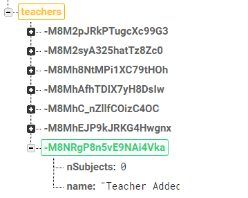	|	✔️	|

Actualizar profesor
-

<table style="width: 100%">
<tr><th>Premisa</th><th>Esperado</th></tr>
<tr>
<td style="vertical-align: top; width: 50%">
Modificar el profesor con los datos:
<pre>
name: 'Jose Angel Martín'
</pre>
cambiándolos a:
<pre>
name: 'Teacher Updated'
</pre>
</td>
<td style="vertical-align: top; width: 50%">
Se modificará el nodo con los nuevos datos:
<pre>
name: 'Teacher Updated'
</pre>
</td>
</tr>
</table>

|	Datos iniciales	|	Datos tras actualización	|	Test	|
|:-:|:-:|:-:|
|	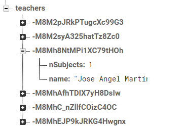	|	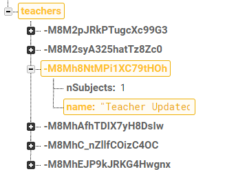	|	✔️	|

Eliminar profesor
-

<table style="width: 100%">
<tr><th>Premisa</th><th>Esperado</th></tr>
<tr>
<td style="vertical-align: top; width: 50%">
Eliminar el profesor con los datos:
<pre>
name: 'Jose Angel Martín'
</pre>
</td>
<td style="vertical-align: top; width: 50%">
Se eliminará el nodo con los datos:
<pre>
nSubjects: 1
name: 'Jose Angel Martín'
</pre>
Se eliminará el campo <code>id_teacher</code> de la asignatura con datos:
<pre>
color: '#8844FF'
id_teacher: -M8Mh8NtMPi1XC79tHOh
name: 'Inglés Técnico'
percentage: 15
</pre>
</td>
</tr>
</table>

|	Datos iniciales	|	Datos tras actualización	|	Test	|
|:-:|:-:|:-:|
|		|	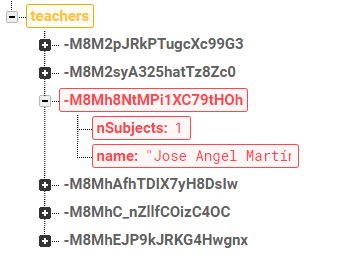	|	✔️	|
|	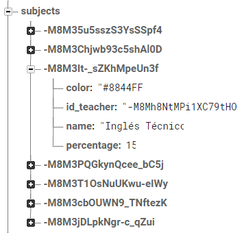	|	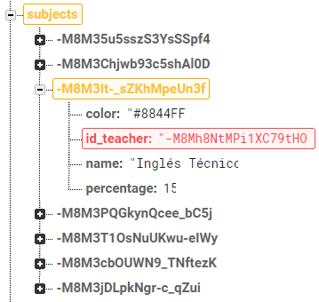	|	✔️	|

## TEST SUBJECTS

Input test
-

<table>
<tr>
<td style="vertical-align: top">

</td>
<td style="vertical-align: top">
Si se intenta guardar una asignatura que no tiene todos los campos rellenos, se mostrará un error en pantalla
</td>
</tr>
</table>

Añadir asignatura
-

<table style="width: 100%">
<tr><th>Premisa</th><th>Esperado</th></tr>
<tr>
<td style="vertical-align: top; width: 50%">
Añadir una nueva asignatura con los datos:
<pre>
color: '#080808'
id_teacher: -M8M2pJRkPTugcXc99G3
name: 'Subject Added'
percentage: 15
</pre>
<code>id_teacher</code> corresponde con el profesor:
<pre>
nSubjects: 1
name: 'Antonio Otero'
</pre>
</td>
<td style="vertical-align: top; width: 50%">
Aparecerá un nuevo nodo con los datos:
<pre>
color: '#080808'
id_teacher: -M8M2pJRkPTugcXc99G3
name: 'Subject Added'
percentage: 15
</pre>
Se incrementará el campo <code>nSubjects</code> del profesor
<pre>
nSubjects: 2
name: 'Antonio Otero'
</pre>
</td>
</tr>
</table>

|	Datos iniciales	|	Datos esperados	|	Test	|
|:-:|:-:|:-:|
|		|	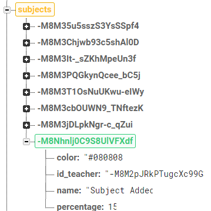	|	✔️	|
|		|		|	✔️	|

Actualizar asignatura
-

<table style="width: 100%">
<tr><th>Premisa</th><th>Esperado</th></tr>
<tr>
<td style="vertical-align: top; width: 50%">
Modificar la asignatura con los datos:
<pre>
color: '#0000FF'
id_teacher: -M8M2syA325hatTz8Zc0
name: 'Empresa e Iniciativa Emprendedora'
percentage: 15
</pre>
<code>id_teacher</code> corresponde con el profesor:
<pre>
nSubjects: 1
name: 'Miguel Salmerón'
</pre>
cambiándolos a:
<pre>
color: '#800080'
id_teacher: -M8MhAfhTDIX7yH8DsIw
name: 'Subject Updated'
percentage: 15
</pre>
<code>id_teacher</code> corresponde con el profesor:
<pre>
nSubjects: 1
name: 'Francisco Javier Cárceles'
</pre>
</td>
<td style="vertical-align: top; width: 50%">
Se modificará el nodo con los nuevos datos:
<pre>
color: '#800080'
id_teacher: -M8MhAfhTDIX7yH8DsIw
name: 'Subject Updated'
percentage: 15
</pre>
Se descrementará el campo <code>nSubjects</code> del profesor anterior
<pre>
nSubjects: 0
name: 'Miguel Salmerón'
</pre>
Se incrementará el campo <code>nSubjects</code> del nuevo profesor
<pre>
nSubjects: 2
name: 'Francisco Javier Cárceles'
</pre>
</td>
</tr>
</table>

|	Datos iniciales	|	Datos esperados	|	Test	|
|:-:|:-:|:-:|
|	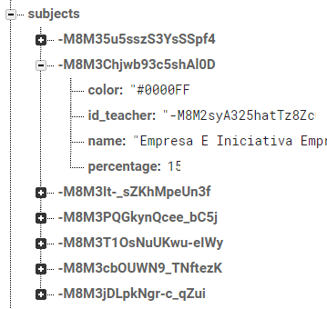	|		|	✔️	|
|		|	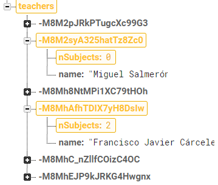	|	✔️	|

Eliminar asignatura
-

<table style="width: 100%">
<tr><th>Premisa</th><th>Esperado</th></tr>
<tr>
<td style="vertical-align: top; width: 50%">
Eliminar la asignatura con los datos:
<pre>
color: '#FF6F6F'
id_teacher: -M8MhAfhTDIX7yH8DsIw
name: 'Programación Multimedia Y Dispositivos Móviles'
percentage: 15
</pre>
<code>id_teacher</code> corresponde con el profesor:
<pre>
nSubjects: 1
name: 'Francisco Javier Cárceles'
</pre>
</td>
<td style="vertical-align: top; width: 50%">
Se eliminará el nodo con los datos:
<pre>
color: '#FF6F6F'
id_teacher: -M8MhAfhTDIX7yH8DsIw
name: 'Programación Multimedia Y Dispositivos Móviles'
percentage: 15
</pre>
Se descrementará el campo <code>nSubjects</code> del profesor
<pre>
nSubjects: 0
name: 'Francisco Javier Cárceles'
</pre>
Se eliminarán los exámenes asociados a la asignatura
<pre>
-M8M4_WAwFKC6Iz9OXPA
</pre>
Se eliminarán las ausencias asociadas a la asignatura
<pre>
-M8M3tXZP7QIDjLZiVqj
-M8M43hlRy0MLITYZRh3
</pre>
Se eliminará el campo <code>id_subject</code> de las clases asociadas a la asignatura
<pre>
-M8M3tXZP7QIDjLZiVqj
-M8M43hlRy0MLITYZRh3 
-M8VxyyyPoG5SvDwqVd0
-M8VyOJo2SryyzcvT-L8
</pre>
</td>
</tr>
</table>

|	Datos iniciales	|	Datos tras actualización	|	Test	|
|:-:|:-:|:-:|
|		|		|	✔️	|
|	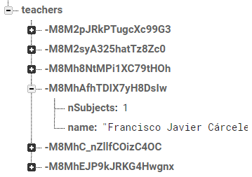	|	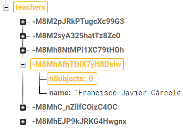	|	✔️	|
|		|	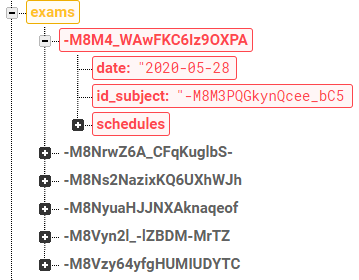	|	✔️	|
|	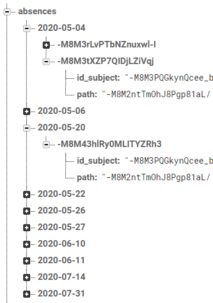	|		|	✔️	|
|		|		|	✔️	|
|		|		|	✔️	|

## TEST ABSENCES

Input test
-

<table>
<tr>
<td style="vertical-align: top">

</td>
<td style="vertical-align: top">
Si se intenta guardar unas vacaciones que no tiene todos los campos rellenos, se mostrará un error en pantalla
</td>
</tr>
<tr>
<td style="vertical-align: top">

</td>
<td style="vertical-align: top">
Si ya existe una clase que ocupa las horas elegidas o parte de ellas, se mostrará un error en pantalla
</td>
</tr>
<tr>
<td style="vertical-align: top">

</td>
<td style="vertical-align: top">
Las horas elegidas no pueden ser iguales, por lo se mostrará un error en pantalla
</td>
</tr>
</table>

Añadir clase
-

<table style="width: 100%">
<tr><th>Premisa</th><th>Esperado</th></tr>
<tr>
<td style="vertical-align: top; width: 50%">
Añadir una clase el martes con los datos:
<pre>
-M8V9HxcOPUM6qsydL4c: {
endTime: '19:30'
id_subject: -M8M3jDLpkNgr-c_qZui
startTime: '17:30'
}
</pre>
<code>id_subject</code> corresponde con la asignatura:
<pre>
Sistemas De Gestión Empresarial
</pre>
</td>
<td style="vertical-align: top; width: 50%">
Aparecerá un nuevo nodo el martes con los datos:
<pre>
-M8V9HxcOPUM6qsydL4c: {
endTime: '19:30'
id_subject: -M8M3jDLpkNgr-c_qZui
startTime: '17:30'
}
</pre>
</td>
</tr>
</table>

|	Datos iniciales	|	Datos tras actualización	|	Test	|
|:-:|:-:|:-:|
|		|		|	✔️	|

Actualizar clase
-

<table style="width: 100%">
<tr><th>Premisa</th><th>Esperado</th></tr>
<tr>
<td style="vertical-align: top; width: 50%">
Modificar una clase el jueves con los datos:
<pre>
-M8M4FZOyJQquzOQY9Tj: {
endTime: '12:30'
id_subject: -M8M3jDLpkNgr-c_qZui
startTime: '10:30'
}
</pre>
<code>id_subject</code> corresponde con la asignatura:
<pre>
Sistemas De Gestión Empresarial
</pre>
</td>
<td style="vertical-align: top; width: 50%">
Se modificará el nodo del jueves con los nuevos datos:
<pre>
-M8M4FZOyJQquzOQY9Tj: {
endTime: '16:30'
id_subject: -M8M3PQGkynQcee_bC5j
startTime: '14:30'
}
</pre>
<code>id_subject</code> corresponde con la asignatura:
<pre>
Programación Multimedia Y Dispositivos Móviles
</pre>
</td>
</tr>
</table>

|	Datos iniciales	|	Datos tras actualización	|	Test	|
|:-:|:-:|:-:|
|		|		|	✔️	|

Eliminar clase
-

<table style="width: 100%">
<tr><th>Premisa</th><th>Esperado</th></tr>
<tr>
<td style="vertical-align: top; width: 50%">
Eliminar la clase del miércoles con los datos:
<pre>
-M8M4FZOyJQquzOQY9Tj: {
endTime: '12:30'
id_subject: -M8M3jDLpkNgr-c_qZui
startTime: '10:30'
}
</pre>
<code>id_subject</code> corresponde con la asignatura:
<pre>
Programación de Servicios Y Procesos
</pre>
Se eliminarán las referencias a ese horario de los exámenes:
<pre>
-M8Ns2NazixKQ6UXhWJh
</pre>
Se eliminarán las ausencias en ese horario:
<pre>
-M8M46OgKvj2GfGbUMNy
</pre>
</td>
<td style="vertical-align: top; width: 50%">
Se eliminará el nodo del miércoles con los datos:
<pre>
-M8M4FZOyJQquzOQY9Tj: {
endTime: '12:30'
id_subject: -M8M3jDLpkNgr-c_qZui
startTime: '10:30'
}
</pre>
<code>id_subject</code> corresponde con la asignatura:
<pre>
Programación Multimedia Y Dispositivos Móviles
</pre>
</td>
</tr>
</table>

|	Datos iniciales	|	Datos tras actualización	|	Test	|
|:-:|:-:|:-:|
|	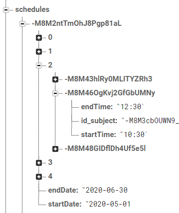	|		|	✔️	|
|		|	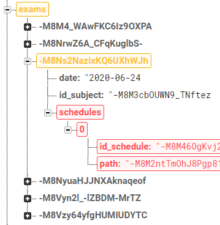	|	✔️	|
|	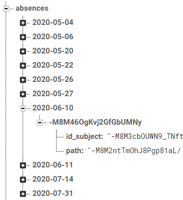	|	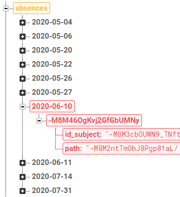	|	✔️	|

## TEST EXAMS

Input test
-

<table>
<tr>
<td style="vertical-align: top">

</td>
<td style="vertical-align: top">
Si se intenta guardar un examen que no tiene todos los campos rellenos, se mostrará un error en pantalla
  
No es obligatorio especificar las clases que ocupa el examen
</td>
</tr>
<tr>
<td style="vertical-align: top">

</td>
<td style="vertical-align: top">
Si ya existe otro examen ese día y tiene alguna clase seleccionada, no permitirá seleccionar las horas ocupadas
</td>
</tr>
</table>

Añadir examen
-

<table style="width: 100%">
<tr><th>Premisa</th><th>Esperado</th></tr>
<tr>
<td style="vertical-align: top; width: 50%">
Añadir un examen con los datos:
<pre>
date: '2020-05-04'
id_subject: -M8M35u5sszS3YsSSpf4
schedules: {
	0
	1
}
</pre>
<code>id_subject</code> corresponde con la asignatura
<pre>
'Acceso A Datos'
</pre>
Los valores <code>0, 1</code> representan las clases que ocupa el examen
<pre>
Lunes 8:30 - 10:30
Desarrollo De Interfaces 
Lunes 10:30 - 12:30
Desarrollo De Interfaces
</pre>
</td>
<td style="vertical-align: top; width: 50%">
Aparecerá un nuevo nodo con los datos:
<pre>
date: '2020-05-04'
id_subject: -M8M35u5sszS3YsSSpf4
schedules: {
	0
	1
}
</pre>
Se eliminarán las faltas de asistencia de las clases ocupadas:
<pre>
-M8M3rLvPTbNZnuxwl-I
</pre>
</td>
</tr>
</table>

|	Datos iniciales	|	Datos esperados	|	Test	|
|:-:|:-:|:-:|
|	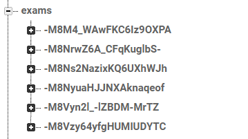	|	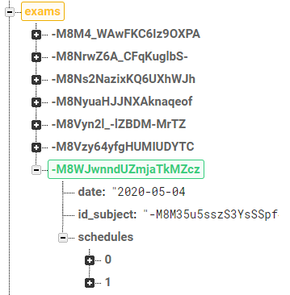	|	✔️	|
|		|		|	✔️	|

Actualizar examen
-

<table style="width: 100%">
<tr><th>Premisa</th><th>Esperado</th></tr>
<tr>
<td style="vertical-align: top; width: 50%">
Modificar el examen con los datos:
<pre>
date: '2020-06-25'
id_subject: -M8M35u5sszS3YsSSpf4
</pre>
<code>id_subject</code> corresponde con la asignatura:
<pre>
'Acceso A Datos'
</pre>
cambiándolos a:
<pre>
date: '2020-05-27'
id_subject: -M8M3PQGkynQcee_bC5j
schedules: {
	0
}
</pre>
<code>id_subject</code> corresponde con la asignatura:
<pre>
'Programación Multimedia Y Dispositivos Móviles'
</pre>
El valor <code>0</code> representa la clase que ocupa el examen
<pre>
Miércoles 12:30 - 14:30
Acceso A Datos
</pre>
</td>
<td style="vertical-align: top; width: 50%">
Se modificará el nodo con los nuevos datos:
<pre>
date: '2020-05-27'
id_subject: -M8M3PQGkynQcee_bC5j
schedules: {
	0
}
</pre>
Se eliminarán las faltas de asistencia de las clases ocupadas:
<pre>
-M8M48GIDflDh4Uf5e5l
</pre>
</td>
</tr>
</table>

|	Datos iniciales	|	Datos esperados	|	Test	|
|:-:|:-:|:-:|
|	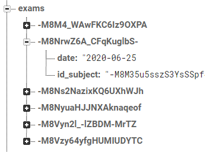	|	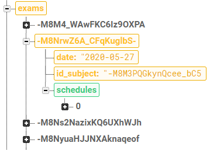	|	✔️	|
|	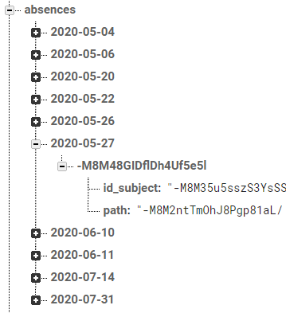	|		|	✔️	|

Eliminar examen
-

<table style="width: 100%">
<tr><th>Premisa</th><th>Esperado</th></tr>
<tr>
<td style="vertical-align: top; width: 50%">
Eliminar el examen con los datos:
<pre>
date: '2020-05-28'
id_subject: -M8M3PQGkynQcee_bC5j
schedules: {
	0
	1
}
</pre>
<code>id_subject</code> corresponde con la asignatura:
<pre>
'Programación Multimedia Y Dispositivos Móviles'
</pre>
Los valores <code>0, 1</code> representan las clases que ocupa el examen
<pre>
Jueves 8:30 - 10:30
Acceso A Datos 
Jueves 10:30 - 12:30
Sistemas De Gestión Empresarial
</pre>
</td>
<td style="vertical-align: top; width: 50%">
Se eliminará el nodo con los datos:
<pre>
date: '2020-05-28'
id_subject: -M8M3PQGkynQcee_bC5j
schedules: {
	0
	1
}
</pre>
</td>
</tr>
</table>

|	Datos iniciales	|	Datos esperados	|	Test	|
|:-:|:-:|:-:|
|	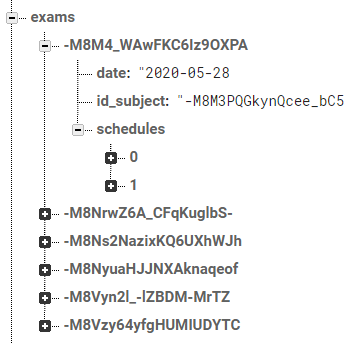	|		|	✔️	|

## TEST HOLIDAYS

Input test
-

<table>
<tr>
<td style="vertical-align: top">

</td>
<td style="vertical-align: top">
Si se intenta guardar unas vacaciones que no tiene todos los campos rellenos, se mostrará un error en pantalla
</td>
</tr>
</table>

Añadir vacaciones
-

<table style="width: 100%">
<tr><th>Premisa</th><th>Esperado</th></tr>
<tr>
<td style="vertical-align: top; width: 50%">
Añadir unas vacaciones con los datos:
<pre>
endDate: '2020-05-28'
name: 'Holidays Added'
startDate: '2020-05-19'
</pre>
</td>
<td style="vertical-align: top; width: 50%">
Aparecerá un nuevo nodo con los datos:
<pre>
endDate: '2020-05-28'
name: 'Holidays Added'
startDate: '2020-05-19'
</pre>
Se eliminarán todas las faltas de asistencia entre esos días
<pre>
-M8M43hlRy0MLITYZRh3
-M8M4KNMzOwQYr69abNy
-M8M4OXNi0202P10Oy2i
-M8M3z83kkPB4JMfd3pu
-M8M48GIDflDh4Uf5e5l
</pre>
Se eliminarán todos los exámenes entre esos días
<pre>
-M8M4_WAwFKC6Iz9OXPA
-M8NrwZ6A_CFqKuglbS-
</pre>
</td>
</tr>
</table>

|	Datos iniciales	|	Datos esperados	|	Test	|
|:-:|:-:|:-:|
|		|		|	✔️	|
|		|	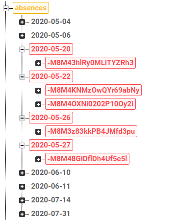	|	✔️	|
|	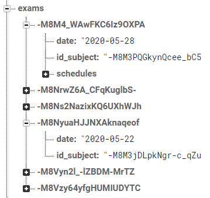	|		|	✔️	|

Actualizar vacaciones
-

<table style="width: 100%">
<tr><th>Premisa</th><th>Esperado</th></tr>
<tr>
<td style="vertical-align: top; width: 50%">
Modificar unas vacaciones con los datos:
<pre>
endDate: '2020-05-01'
name: 'Vacaciones'
startDate: '2020-05-03'
</pre>
cambiándolos a:
<pre>
endDate: '2020-05-01'
name: 'Holidays Updated'
startDate: '2020-05-05'
</pre>
</td>
<td style="vertical-align: top; width: 50%">
Se modificará el nodo con los nuevos datos:
<pre>
endDate: '2020-05-01'
name: 'Holidays Updated'
startDate: '2020-05-05'
</pre>
Se eliminarán todas las faltas de asistencia entre esos días
<pre>
-M8M3rLvPTbNZnuxwl-I
-M8M3tXZP7QIDjLZiVqj
</pre>
Se eliminarán todos los exámenes entre esos días:
<pre>
-M8Vzy64yfgHUMIUDYTC
</pre>
</td>
</tr>
</table>

|	Datos iniciales	|	Datos esperados	|	Test	|
|:-:|:-:|:-:|
|	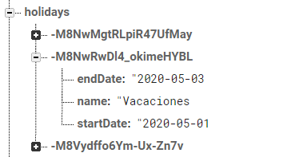	|	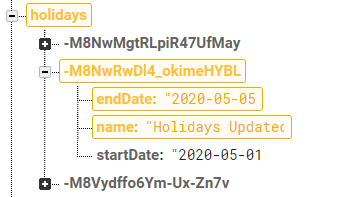	|	✔️	|
|	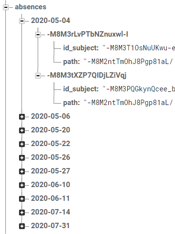	|	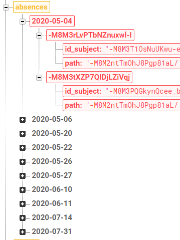	|	✔️	|
|		|		|	✔️	|

Eliminar vacaciones
-

<table style="width: 100%">
<tr><th>Premisa</th><th>Esperado</th></tr>
<tr>
<td style="vertical-align: top; width: 50%">
Eliminar las vacaciones con los datos:
<pre>
endDate: '2020-05-01'
name: 'Vacaciones'
startDate: '2020-05-03'
</pre>
</td>
<td style="vertical-align: top; width: 50%">
Se eliminará el nodo con los datos:
<pre>
endDate: '2020-05-01'
name: 'Vacaciones'
startDate: '2020-05-03'
</pre>
</td>
</tr>
</table>

|	Datos iniciales	|	Datos esperados	|	Test	|
|:-:|:-:|:-:|
|		|		|	✔️	|

## TEST ABSENCES

Añadir ausencia
-

<table style="width: 100%">
<tr><th>Premisa</th><th>Esperado</th></tr>
<tr>
<td style="vertical-align: top; width: 50%">
Añadir una ausencia el día <code>2020-05-14</code> con los datos:
<pre>
-M8M4C246nqriWbpp170: {
id_subject: -M8M35u5sszS3YsSSpf4
path: -M8M2ntTmOhJ8Pgp81aL/3
}
</pre>
</td>
<td style="vertical-align: top; width: 50%">
Aparecerá un nuevo nodo con el día <code>2020-05-14</code> con los datos:
<pre>
-M8M4C246nqriWbpp170: {
id_subject: -M8M35u5sszS3YsSSpf4
path: -M8M2ntTmOhJ8Pgp81aL/3
}
</pre>
</td>
</tr>
</table>

|	Datos iniciales	|	Datos tras actualización	|	Test	|
|:-:|:-:|:-:|
|	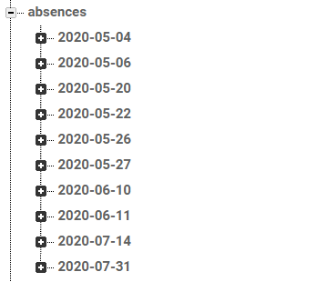	|		|	✔️	|

Eliminar ausencia
-

<table style="width: 100%">
<tr><th>Premisa</th><th>Esperado</th></tr>
<tr>
<td style="vertical-align: top; width: 50%">
Eliminar la ausencia del día <code>2020-05-20</code> con los datos:
<pre>
-M8M43hlRy0MLITYZRh3: {
id_subject: -M8M3PQGkynQcee_bC5j
path: -M8M2ntTmOhJ8Pgp81aL/2
}
</pre>
</td>
<td style="vertical-align: top; width: 50%">
Se eliminará el nodo del día <code>2020-05-20</code> con los datos:
<pre>
-M8M43hlRy0MLITYZRh3: {
id_subject: -M8M3PQGkynQcee_bC5j
path: -M8M2ntTmOhJ8Pgp81aL/2
}
</pre>
</td>
</tr>
</table>

|	Datos iniciales	|	Datos tras actualización	|	Test	|
|:-:|:-:|:-:|
|	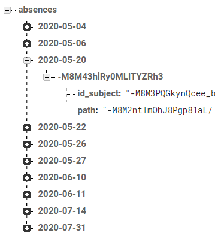	|	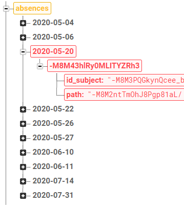	|	✔️	|

## TEST TIEMTABLES

Input test
-

<table>
<tr>
<td style="vertical-align: top">

</td>
<td style="vertical-align: top">
Si se intenta guardar un horario que no tiene todos los campos rellenos, se mostrará un error en pantalla
</td>
</tr>
<tr>
<td style="vertical-align: top">

</td>
<td style="vertical-align: top">
Si la fecha inicial no es anterior a la fecha final, se mostrará un error en pantalla
</td>
</tr>
</table>

Cada prueba tendrá asociado una representación esquemática de cómo afecta a los diferentes horarios de la aplicación.

Originalmente tenemos dos horarios

Añadir horario
-

<table style="width: 100%">
<tr><th>Premisa</th><th>Esperado</th></tr>
<tr>
<td style="vertical-align: top; width: 50%">
Añadir un horario con los datos:
<pre>
endDate: '2020-08-31'
startDate: '2020-08-01'
</pre>
</td>
<td style="vertical-align: top; width: 50%">
Aparecerá un nuevo nodo con los datos:
<pre>
endDate: '2020-08-31'
startDate: '2020-08-01'
</pre>
</td>
</tr>
</table>

|	Datos iniciales	|	Datos esperados	|	Test	|
|:-:|:-:|:-:|
|		|		|	✔️	|

<table style="width: 100%">
<tr><th>Premisa</th><th>Esperado</th></tr>
<tr>
<td style="vertical-align: top; width: 50%">
Añadir un horario con los datos:
<pre>
endDate: '2020-08-31'
startDate: '2020-08-10'
</pre>
</td>
<td style="vertical-align: top; width: 50%">
Aparecerá un nuevo nodo con los datos:
<pre>
endDate: '2020-08-31'
startDate: '2020-08-10'
</pre>
Se actualizará el campo <code>endDate</code> del horario anterior:
<pre>
endDate: '2020-08-09'
startDate: '2020-07-01'
</pre>
</td>
</tr>
</table>

|	Datos iniciales	|	Datos esperados	|	Test	|
|:-:|:-:|:-:|
|		|		|	✔️	|

<table style="width: 100%">
<tr><th>Premisa</th><th>Esperado</th></tr>
<tr>
<td style="vertical-align: top; width: 50%">
Añadir un horario con los datos:
<pre>
endDate: '2020-08-31'
startDate: '2020-07-10'
</pre>
</td>
<td style="vertical-align: top; width: 50%">
Aparecerá un nuevo nodo con los datos:
<pre>
endDate: '2020-08-31'
startDate: '2020-07-10'
</pre>
Se actualizará el campo <code>endDate</code> del horario anterior:
<pre>
endDate: '2020-07-09'
startDate: '2020-07-01'
</pre>
Se eliminarán todas las faltas de asistencia entre <code>2020-07-10 - 2020-08-31</code>
<pre>
-M8VxoyFo8FYYvCKPa8L
-M8VyM8HX3s7t-smwqzP
</pre>
Se eliminarán todos los exámenes entre <code>2020-07-10 - 2020-08-31</code>
<pre>
-M8Vyn2l_-lZBDM-MrTZ
</pre>
</td>
</tr>
</table>

|	Datos iniciales	|	Datos esperados	|	Test	|
|:-:|:-:|:-:|
|		|		|	✔️	|
|		|		|	✔️	|
|		|		|	✔️	|

<table style="width: 100%">
<tr><th>Premisa</th><th>Esperado</th></tr>
<tr>
<td style="vertical-align: top; width: 50%">
Añadir un horario con los datos:
<pre>
endDate: '2020-08-31'
startDate: '2020-06-25'
</pre>
</td>
<td style="vertical-align: top; width: 50%">
Aparecerá un nuevo nodo con los datos:
<pre>
endDate: '2020-08-31'
startDate: '2020-06-25'
</pre>
Se eliminará el horario:
<pre>
-M8VxKh1HefKXQcXdhK8
</pre>
Se actualizará el campo <code>endDate</code> del horario anterior:
<pre>
endDate: '2020-06-24'
startDate: '2020-05-01'
</pre>
Se eliminarán todas las faltas de asistencia entre <code>2020-06-25 - 2020-08-31</code>
<pre>
-M8VxoyFo8FYYvCKPa8L
-M8VyM8HX3s7t-smwqzP
</pre>
Se eliminarán todos los exámenes entre <code>2020-06-25 - 2020-08-31</code>
<pre>
-M8NrwZ6A_CFqKuglbS-
-M8Vyn2l_-lZBDM-MrTZ
</pre>
</td>
</tr>
</table>

|	Datos iniciales	|	Datos esperados	|	Test	|
|:-:|:-:|:-:|
|		|		|	✔️	|
|		|		|	✔️	|
|		|		|	✔️	|

Actualizar horario
-

<table style="width: 100%">
<tr><th>Premisa</th><th>Esperado</th></tr>
<tr>
<td style="vertical-align: top; width: 50%">
Modificar el horario con los datos:
<pre>
endDate: '2020-06-30'
startDate: '2020-05-01'
</pre>
cambiándolos a:
<pre>
endDate: '2020-07-24'
startDate: '2020-05-01'
</pre>
</td>
<td style="vertical-align: top; width: 50%">
Se modificará el nodo con los nuevos datos:
<pre>
endDate: '2020-07-24'
startDate: '2020-05-01'
</pre>
Se actualizará el campo <code>startDate</code> del horario posterior:
<pre>
endDate: '2020-07-31'
startDate: '2020-07-25'
</pre>
Se eliminarán todas las faltas de asistencia entre <code>2020-07-01 - 2020-07-24</code>
<pre>
-M8VxoyFo8FYYvCKPa8L
</pre>
Se eliminarán todos los exámenes entre <code>2020-07-01 - 2020-07-24</code>
<pre>
-M8Vyn2l_-lZBDM-MrTZ
</pre>
</td>
</tr>
</table>

|	Datos iniciales	|	Datos esperados	|	Test	|
|:-:|:-:|:-:|
|		|		|	✔️	|
|		|		|	✔️	|
|		|		|	✔️	|

<table style="width: 100%">
<tr><th>Premisa</th><th>Esperado</th></tr>
<tr>
<td style="vertical-align: top; width: 50%">
Modificar el horario con los datos:
<pre>
endDate: '2020-07-31'
startDate: '2020-07-01'
</pre>
cambiándolos a:
<pre>
endDate: '2020-07-31'
startDate: '2020-06-09'
</pre>
</td>
<td style="vertical-align: top; width: 50%">
Se modificará el nodo con los nuevos datos:
<pre>
endDate: '2020-07-31'
startDate: '2020-06-09'
</pre>
Se actualizará el campo <code>endDate</code> del horario posterior:
<pre>
endDate: '2020-06-08'
startDate: '2020-05-01'
</pre>
Se eliminarán todas las faltas de asistencia entre <code>2020-06-09 - 2020-06-30</code>
<pre>
-M8M46OgKvj2GfGbUMNy
-M8M4FZOyJQquzOQY9Tj
</pre>
Se eliminarán todos los exámenes entre <code>2020-06-09 - 2020-06-30</code>
<pre>
-M8Ns2NazixKQ6UXhWJh
-M8NrwZ6A_CFqKuglbS-
</pre>
</td>
</tr>
</table>

|	Datos iniciales	|	Datos esperados	|	Test	|
|:-:|:-:|:-:|
|		|		|	✔️	|
|		|		|	✔️	|
|		|		|	✔️	|

<table style="width: 100%">
<tr><th>Premisa</th><th>Esperado</th></tr>
<tr>
<td style="vertical-align: top; width: 50%">
Modificar el horario con los datos:
<pre>
endDate: '2020-06-30'
startDate: '2020-05-01'
</pre>
cambiándolos a:
<pre>
endDate: '2020-08-05'
startDate: '2020-05-01'
</pre>
</td>
<td style="vertical-align: top; width: 50%">
Se modificará el nodo con los nuevos datos:
<pre>
endDate: '2020-08-05'
startDate: '2020-05-01'
</pre>
Se eliminará el horario:
<pre>
-M8VxKh1HefKXQcXdhK8
</pre>
Se eliminarán todas las faltas de asistencia entre <code>2020-07-01 - 2020-08-05</code>
<pre>
-M8VxoyFo8FYYvCKPa8L
-M8VyM8HX3s7t-smwqzP
</pre>
Se eliminarán todos los exámenes entre <code>2020-07-01 - 2020-08-05</code>
<pre>
-M8Vyn2l_-lZBDM-MrTZ
</pre>
</td>
</tr>
</table>

|	Datos iniciales	|	Datos esperados	|	Test	|
|:-:|:-:|:-:|
|		|		|	✔️	|
|		|		|	✔️	|
|		|		|	✔️	|

<table style="width: 100%">
<tr><th>Premisa</th><th>Esperado</th></tr>
<tr>
<td style="vertical-align: top; width: 50%">
Modificar el horario con los datos:
<pre>
endDate: '2020-07-31'
startDate: '2020-07-01'
</pre>
cambiándolos a:
<pre>
endDate: '2020-07-31'
startDate: '2020-04-23'
</pre>
</td>
<td style="vertical-align: top; width: 50%">
Se modificará el nodo con los nuevos datos:
<pre>
endDate: '2020-07-31'
startDate: '2020-04-23'
</pre>
Se eliminará el horario:
<pre>
-M8VxKh1HefKXQcXdhK8
</pre>
Se eliminarán todas las faltas de asistencia entre <code>2020-04-23 - 2020-06-30</code>
<pre>
-M8M3rLvPTbNZnuxwl-I
-M8M3tXZP7QIDjLZiVqj
-M8M48GIDflDh4Uf5e5l
-M8M43hlRy0MLITYZRh3
-M8M4KNMzOwQYr69abNy
-M8M4OXNi0202P10Oy2i
-M8M3z83kkPB4JMfd3pu
-M8M48GIDflDh4Uf5e5l
-M8M46OgKvj2GfGbUMNy
-M8M4FZOyJQquzOQY9Tj
</pre>
Se eliminarán todos los exámenes entre <code>2020-04-23 - 2020-06-30</code>
<pre>
-M8M4_WAwFKC6Iz9OXPA
-M8NrwZ6A_CFqKuglbS-
-M8Ns2NazixKQ6UXhWJh
-M8NyuaHJJNXAknaqeof
-M8Vzy64yfgHUMIUDYTC
</pre>
</td>
</tr>
</table>

|	Datos iniciales	|	Datos esperados	|	Test	|
|:-:|:-:|:-:|
|		|		|	✔️	|
|		|		|	✔️	|
|		|		|	✔️	|

Eliminar horario
-

<table style="width: 100%">
<tr><th>Premisa</th><th>Esperado</th></tr>
<tr>
<td style="vertical-align: top; width: 50%">
Eliminar el horario con los datos:
<pre>
endDate: '2020-06-30'
startDate: '2020-05-01'
</pre>
</td>
<td style="vertical-align: top; width: 50%">
Se eliminará el nodo con los datos:
<pre>
endDate: '2020-06-30'
startDate: '2020-05-01'
</pre>
Se eliminarán todas las faltas de asistencia entre <code>2020-05-01 - 2020-06-30</code>
<pre>
-M8M3rLvPTbNZnuxwl-I
-M8M3tXZP7QIDjLZiVqj
-M8M48GIDflDh4Uf5e5l
-M8M43hlRy0MLITYZRh3
-M8M4KNMzOwQYr69abNy
-M8M4OXNi0202P10Oy2i
-M8M3z83kkPB4JMfd3pu
-M8M48GIDflDh4Uf5e5l
-M8M46OgKvj2GfGbUMNy
-M8M4FZOyJQquzOQY9Tj
</pre>
Se eliminarán todos los exámenes entre <code>2020-05-01 - 2020-06-30</code>
<pre>
-M8M4_WAwFKC6Iz9OXPA
-M8NrwZ6A_CFqKuglbS-
-M8Ns2NazixKQ6UXhWJh
-M8NyuaHJJNXAknaqeof
-M8Vzy64yfgHUMIUDYTC
</pre>
</td>
</tr>
</table>

|	Datos iniciales	|	Datos esperados	|	Test	|
|:-:|:-:|:-:|
|		|	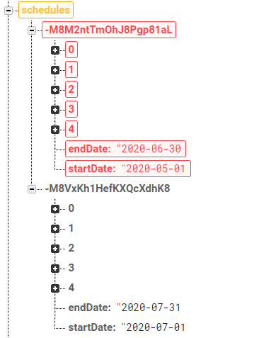	|	✔️	|
|	Mismas que en el caso de **Update 2**	|	Mismas que en el caso de **Update 2**	|	✔️	|
|	Mismas que en el caso de **Update 2**	|	Mismas que en el caso de **Update 2**	|	✔️	|

<table style="width: 100%">
<tr><th>Premisa</th><th>Esperado</th></tr>
<tr>
<td style="vertical-align: top; width: 50%">
Eliminar el horario con los datos:
<pre>
endDate: '2020-07-31'
startDate: '2020-07-01'
</pre>
</td>
<td style="vertical-align: top; width: 50%">
Se eliminará el nodo con los datos:
<pre>
endDate: '2020-07-31'
startDate: '2020-07-01'
</pre>
Se eliminarán todas las faltas de asistencia entre <code>2020-07-01 - 2020-07-31</code>
<pre>
-M8VxoyFo8FYYvCKPa8L
-M8VyM8HX3s7t-smwqzP
</pre>
Se eliminarán todos los exámenes entre <code>2020-07-01 - 2020-07-31</code>
<pre>
-M8Vyn2l_-lZBDM-MrTZ
</pre>
</td>
</tr>
</table>
</td>
</tr>
</table>

|	Datos iniciales	|	Datos esperados	|	Test	|
|:-:|:-:|:-:|
|		|		|	✔️	|
|	Mismas que en el caso de **Update 3**	|	Mismas que en el caso de **Update 3**	|	✔️	|
|	Mismas que en el caso de **Update 3**	|	Mismas que en el caso de **Update 3**	|	✔️	|

## CONTRIBUIDORES

| **Jorge Chércoles Moreno** |
| :-: |
|  |
| <a href="http://github.com/Chiefbark" target="_blank">`github.com/Chiefbark`</a> |