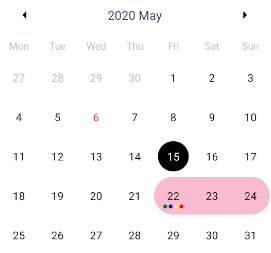

### CALENDAR DAY

Con este componente se eliminan las restricciones del componente [React native Calendars](https://www.npmjs.com/package/react-native-calendars) de soportar sólo un tipo de marcado.

Para implementarlo hay que utilizar la propiedad `dayComponent={({date, state, marking}) => ...}` de `Calendar` y devolver este componente.



**Propiedades**
-

**`date ( required )`**

Día del calendario.
<br>
Recibe un `object` => `{ day: Number, month: Number, year: Number, timestamp: Number, dateString: String }`

- `day` : día del calendario (1-31) (required)
- `month` : mes del calendario (1-12) (required)
- `year` : año del calendario (required)
- `timestamp` : tiempo en milisegundos del calendario (required)
- `dateString` : fecha formateada (`yyyy-MM-dd`) del calendario (required)

```jsx
<CalendarDay date={{day: 6, month: 5, year: 2020, timestamp: 1588716000000, dateString: '2020-05-06'}}/>
```


<div style="page-break-after: always;"></div>

**`state ( optional )`**

Estado del día
<br>
Recibe un `string ['disabled', '', 'today']`. Por defecto el valor es `''`
```ts
<CalendarDay date={date} state={'disabled'}/>
<CalendarDay date={date} state={'today'}/>
```


**`marking ( optional )`**

Marcas que tiene el día
<br>
Recibe un `object` compuesto por tres claves. Por defecto el valor es `{}`

- `single`
<br>
Recibe un `object` => `{ color: String, textColor: String }`

  - `color` : color de fondo del día (required)
  - `textColor` : color del texto del día (required)

```jsx
<CalendarDay date={date} marking={{single: {color: '#FF0000', textColor: '#FFFFFF'}}}/>
```


- `multi`
<br>
Recibe un `array` de `object` => `{ color: String }`

  - `color` : color de fondo del círculo del día (required)

```jsx
<CalendarDay date={date}
			 marking={{multi: [
				 {color: '#FF0000'},
				 {color: '#00FF00'},
				 {color: '#0000FF'}
			 ]}}/>
```


<div style="page-break-after: always;"></div>

- `selection`
<br>
Recibe un `object` => `{ color: String, isStart: Bool, isEnd: Bool }`

  - `color` : color de fondo del día (required)
  - `isStart` : indica si el día es el comienzo de la selección (optional)
  - `isEnd` : indica si el día es el final de la selección (optional)

```ts
<CalendarDay date={date}
			 marking={{selection: {color: '#FF6666'}}}/>
<CalendarDay date={date}
			 marking={{selection: {color: '#FF6666', isStart: true}}}/>
<CalendarDay date={date}
			 marking={{selection: {color: '#FF6666', isEnd: true}}}/>
<CalendarDay date={date}
			 marking={{selection: {color: '#FF6666', isStart: true, isEnd: true}}}/>
```


El resultado de combinar las anteriores es:


**`onClick ( optional )`**

Función llamada cuando el usuario pulsa el componente.
<br>
Recibe un parámetro `value` que indica el objecto `date` del día pulsado
```jsx
<CalendarDay date={date} onClick={(value) => alert('valor: ' + value)}/>
```

**`onLongClick ( optional )`**

Función llamada cuando el usuario mantiene pulsado el componente.
<br>
Recibe un parámetro `value` que indica el objecto `date` del día mantenido
```jsx
<CalendarDay date={date} onLongClick={(value) => alert('valor: ' + value)}/>
```

<div style="page-break-after: always;"></div>