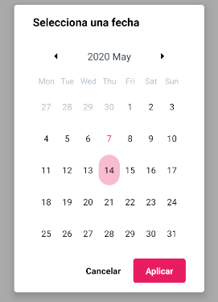

### CALENDAR PICKER

Este componente es una especialización del componente [React native Calendars](https://www.npmjs.com/package/react-native-calendars) que permite al usuario seleccionar rangos de fechas.

&#9888; **IMPORTANTE**
<br>
Si se quiere modificar las propiedades `startDate` y `endDate` de este componente en tiempo de ejecución, será necesario desmontar el componente y volver a montarlo.
<br>
Así sería una posible implementación
```jsx
<Button label={'Mostrar diálogo'} onClick={() => this.setState({visible: true})}/>

{this.state.visible && 
<CalendarPicker onCancel={() => this.setState({visible: false})}
				onSubmit={(startDate, endDate) => 
					this.setState({
						startDate: startDate,
						endDate: endDate,
						visible: false
					})
				}
				startDate={this.state.startDate}
				endDate={this.state.endDate}
/>}
```
|	|	|	|
|:-:|:-:|:-:|
|	 |	 |	 |

<div style="page-break-after: always;"></div>

**Propiedades**
-

**`onSubmit, onCancel ( required )`**

- **onSubmit**<br>
Función llamada cuando el usuario acepta el diálogo.
<br>
Recibe dos parámetros `startDate : String , endDate : String` que representan las fechas inicial y final selccionadas. Ambos datos con el formato `yyyy-MM-dd`.

- **onCancel**<br>
Función llamada cuando el usuario cancela el diálogo.

```jsx
<CalendarPicker onCancel={() => console.log('cancelado')}
				onSubmit={(startDate, endDate) => console.log(startDate, endDate)}
/>
```

**`multiple ( optional )`**

Especifica si el componente permite selección múltiple o no.
<br>
Recibe un `bool`. Por defecto el valor es `true`
```jsx
<CalendarPicker onCancel={() => console.log('cancelado')}
				onSubmit={(startDate, endDate) => console.log(startDate, endDate)}
				multiple={false}
/>
```


<div style="page-break-after: always;"></div>

**`startDate ( optional )`**

Indica la fecha inicial de la selección del componente.
<br>
Recibe un `string` con el formato `yyyy-MM-dd`
```jsx
<CalendarPicker onCancel={() => console.log('cancelado')}
				onSubmit={(startDate, endDate) => console.log(startDate, endDate)}
				startDate={'2020-05-13'}
/>
```

**`endDate ( optional )`**

Indica la fecha final de la selección del componente. Si la propiedad `startDate` no está definida, esta propiedad no se tendrá en cuenta.
<br>
Recibe un `string` con el formato `yyyy-MM-dd`
```jsx

<CalendarPicker onCancel={() => console.log('cancelado')}
				onSubmit={(startDate, endDate) => console.log(startDate, endDate)}
				startDate={'2020-05-13'}
				endDate={'2020-05-30'}
/>
```


<div style="page-break-after: always;"></div>