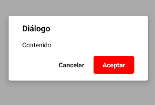

### DIALOG

Este componente permite mostrar diálogos modales personalizables.
<br>
Si el contenido del diálogo es muy grande, añadirá un scroll automaticamente para poder visualizar todo.

```jsx
this.state = {visible: true};

<Dialog title={'Diálogo'} visible={this.state.visible}
		buttons={() => 
		<Fragment>
			<Button label={'Cancelar'} 
					onClick={() => this.setState({visible: false})}/>
			<Button label={'Aceptar'} 
					backgroundColor={'#FF0000'}
					textColor={'#FFFFFF'}
					onClick={() => this.setState({visible: false})}/>
		</Fragment>
		}
		content={() => <Text>Contenido</Text>}/>
```


**Propiedades**
-

**`title, buttons ( required )`**

- **Title**<br>
Define el título que va a tener el diálogo.
<br>
Recibe un `string`

- **Buttons**<br>
Renderiza un componente que hace la función de acciones del diálogo. Lo ideal es devolver un `Fragment` con los botones dentro. Por comodidad, estamos utilizando el componente [Button](button.md).
<br>
Recibe una `function` que devuelve un `component`

<div style="page-break-after: always;"></div>

```jsx
<Dialog title={'Diálogo'} visible={true}
		buttons={() => 
		<Button label={'Aceptar'} backgroundColor={'#FF0000'} textColor={'#FFFFFF'}/>
		}/>
```


**`content ( optional )`**

Renderiza un componente que hace la función de contenido del diálogo. Lo ideal es devolver un `Fragment` con el contenido dentro.
<br>
Recibe una `function` que devuelve un `component`
```jsx
<Dialog title={'Diálogo'} visible={true}
		buttons={() => <Button label={'Aceptar'} backgroundColor={'#FF0000'} textColor={'#FFFFFF'}/>}
		content={() => <Text>Contenido</Text>}/>
```


**`visible ( optional )`**

Especifica si el componente es visible o no.
<br>
Recibe un `bool`. Por defecto el valor es `false`

<div style="page-break-after: always;"></div>