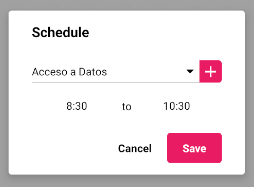

### SCHEDULE FORM

Este componente permite crear y editar clases dentro de la aplicación.
<br>
El formulario actualiza automáticamente la base de datos, por lo que no hay que añadir ninguna funcionalidad extra para realizar estas funciones.

Si algún campo del formulario no está relleno, saldrá un error cuando se intente confirmar el diálogo.

Permite crear asignaturas pulsando en el icono `+` del campo de asignatura. Gracias a esto el usuario no tiene que cancelar el formulario para crear una asignatura que no tenia.

&#9888; **IMPORTANTE**
<br>
Si se quiere modificar la propiedad `schedule` de este componente en tiempo de ejecución, será necesario desmontar el componente y volver a montarlo.
<br>
Así sería una posible implementación
```jsx
<Button label={'Mostrar formulario'} onClick={() => this.setState({visible: true})}/>

{this.state.visible && 
<ScheduleForm onCancel={() => console.log('cancelado')}
			  onSubmit={(key) => {
				 console.log(key);
				 this.setState({visible: false});
			 }
/>}
```

**Propiedades**
-

**`onSubmit, onCancel ( required )`**

- **onSubmit**<br>
Función llamada cuando el usuario acepta el diálogo.
<br>
Recibe un parámetro `key : String` que representa el id del horario creado/actualizado.

- **onCancel**<br>
Función llamada cuando el usuario cancela el diálogo.

<div style="page-break-after: always;"></div>

```jsx
<ScheduleForm onCancel={() => console.log('cancelado')}
			  onSubmit={(key) => console.log(key)}/>
```


**`schedule ( optional )`**

Define el los datos iniciales que se van a cargar en el formulario.
<br>
Recibe un `object` compuesto de dos claves

- `key` : id del horario (required)
- `obj`
<br>
Recibe un `object` => `{startTime : String, endTime: String, id_subject: String}`

  - `startTime` : hora de inicio de la clase (required)
  - `endTime` : hora de fin de la clase (required)
  - `id_subject` : id de la asignatura asociada (optional)

<div style="page-break-after: always;"></div>

&#9888; **Por qué `id_subject` puede ser opcional**
<br>
Este valor puede ser opcional debido a que el usuario puede eliminar la asignatra asociada a dicho horario. Cuando esto pasa, el horario no se elimina, por lo que es posible que se diera el caso.
<br>
Cuando se edite un horario que no tenga asignatura, se marcará como vacío dicho cambio.

```jsx
<SubjectForm onCancel={() => console.log('cancelado')}
			 onSubmit={(key) => console.log(key)}
			 subject={{
				 key: 'schedule_key',
				 obj: {
					 startTime: '8:30',
					 endTime: '10:30',
					 id_subject: 'subject_key'
				 }
			 }}/>
```


<div style="page-break-after: always;"></div>