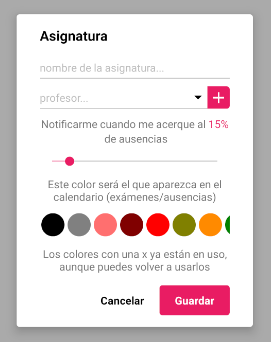
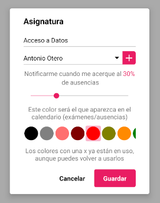

### SUBJECT FORM

Este componente permite crear y editar asignaturas dentro de la aplicación.
<br>
El formulario actualiza automáticamente la base de datos, por lo que no hay que añadir ninguna funcionalidad extra para realizar estas funciones.

Si algún campo del formulario no está relleno, saldrá un error cuando se intente confirmar el diálogo.

Permite crear profesores pulsando en el icono `+` del campo de profesor. Gracias a esto el usuario no tiene que cancelar el formulario para crear un profesor que no tenia.

&#9888; **IMPORTANTE**
<br>
Si se quiere modificar la propiedad `subject` de este componente en tiempo de ejecución, será necesario desmontar el componente y volver a montarlo.
<br>
Así sería una posible implementación
```jsx
<Button label={'Mostrar formulario'} onClick={() => this.setState({visible: true})}/>

{this.state.visible && 
<SubjectForm onCancel={() => this.setState({visible: false})}
			 onSubmit={(key) => {
				 console.log(key);
				 this.setState({visible: false});
			 }
/>}
```

**Propiedades**
-

**`onSubmit, onCancel ( required )`**

- **onSubmit**<br>
Función llamada cuando el usuario acepta el diálogo.
<br>
Recibe un parámetro `key : String` que representa el id de la asignatua creada/actualizada.

- **onCancel**<br>
Función llamada cuando el usuario cancela el diálogo.

<div style="page-break-after: always;"></div>

```jsx
<SubjectForm onCancel={() => console.log('cancelado')}
			 onSubmit={(key) => console.log(key)}/>
```


**`subject ( optional )`**

Define el los datos iniciales que se van a cargar en el formulario.
<br>
Recibe un `object` compuesto de dos claves

- `key` : id del profesor (required)
- `obj`
<br>
Recibe un `object` => `{name : String, percentage: Number. color: String, id_teacher: String}`

  - `name` : nombre de la asignatura (required)
  - `percentage` : porcentage de la asignatura (required)
  - `color` : color de la asignatura (required)
  - `id_teacher` : id del profesor asociado (optional)

<div style="page-break-after: always;"></div>

&#9888; **Por qué `id_teacher` puede ser opcional**
<br>
Este valor puede ser opcional debido a que el usuario puede eliminar el profesor asociado a dicha asignatura. Cuando esto pasa, la asignatura no se elimina, por lo que es posible que se diera el caso.
<br>
Cuando se edite una asignatura que no tenga profesor, se marcará como vacío dicho cambio.

```jsx
<SubjectForm onCancel={() => console.log('cancelado')}
			 onSubmit={(key) => console.log(key)}
			 subject={{
				 key: 'subject_key',
				 obj: {
					 name: 'Acceso a Datos',
					 percentage: 30,
					 color: '#FF0000',
					 id_teacher: 'teacher_key'
				 }
			 }}/>
```


<div style="page-break-after: always;"></div>