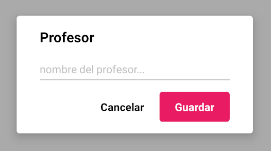
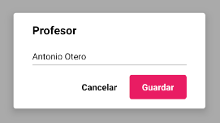

### TEACHER FORM

Este componente permite crear y editar profesores dentro de la aplicación.
<br>
El formulario actualiza automáticamente la base de datos, por lo que no hay que añadir ninguna funcionalidad extra para realizar estas funciones.

Si algún campo del formulario no está relleno, saldrá un error cuando se intente confirmar el diálogo.

&#9888; **IMPORTANTE**
<br>
Si se quiere modificar la propiedad `teacher` de este componente en tiempo de ejecución, será necesario desmontar el componente y volver a montarlo.
<br>
Así sería una posible implementación
```jsx
<Button label={'Mostrar formulario'} onClick={() => this.setState({visible: true})}/>

{this.state.visible && 
<TeacherForm onCancel={() => this.setState({visible: false})}
			 onSubmit={(key) => {
				 console.log(key);
				 this.setState({visible: false});
			 }
/>}
```

**Propiedades**
-

**`onSubmit, onCancel ( required )`**

- **onSubmit**<br>
Función llamada cuando el usuario acepta el diálogo.
<br>
Recibe un parámetro `key : String` que representa el id del profesor creado/actualizado.

- **onCancel**<br>
Función llamada cuando el usuario cancela el diálogo.

```jsx
<TeacherForm onCancel={() => console.log('cancelado')}
			 onSubmit={(key) => console.log(key)}/>
```


<div style="page-break-after: always;"></div>

**`teacher ( optional )`**

Define el los datos iniciales que se van a cargar en el formulario.
<br>
Recibe un `object` compuesto de dos claves

- `key` : id del profesor (required)
- `obj`
<br>
Recibe un `object` => `{name : String}`

  - `name` : nombre del profesor (required)

```jsx
<TeacherForm onCancel={() => console.log('cancelado')}
			 onSubmit={(key) => console.log(key)}
			 subject={{
				 key: 'teacher_key',
				 obj: {name: 'Antonio Otero'}
			 }}/>
```


<div style="page-break-after: always;"></div>