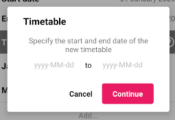
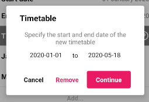

### TIMETABLE FORM

Este componente permite crear y editar horarios dentro de la aplicación.
<br>
El formulario actualiza automáticamente la base de datos, por lo que no hay que añadir ninguna funcionalidad extra para realizar estas funciones.

Si algún campo del formulario no está relleno, saldrá un error cuando se intente confirmar el diálogo.

Estos horarios permiten tener diferentes rangos de tiempo con diferentes asignaturas.

&#9888; **IMPORTANTE**
<br>
Si se quiere modificar la propiedad `timetable` de este componente en tiempo de ejecución, será necesario desmontar el componente y volver a montarlo.
<br>
Así sería una posible implementación
```jsx
<Button label={'Mostrar formulario'} onClick={() => this.setState({visible: true})}/>

{this.state.visible && 
<TimetableForm onCancel={() => console.log('cancelado')}
			   onDelete={() => console.log('eliminado')}
			   onSubmit={(key) => {
				  console.log(key);
				  this.setState({visible: false});
			 }
/>}
```

**Propiedades**
-

**`onSubmit, onCancel, onDelete ( required )`**

- **onSubmit**<br>
Función llamada cuando el usuario acepta el diálogo.
<br>
Recibe un parámetro `key : String` que representa el id del horario creado/actualizado.

- **onCancel**<br>
Función llamada cuando el usuario cancela el diálogo.

- **onDelete**<br>
Función llamada cuando el usuario elimina el horario.

<div style="page-break-after: always;"></div>

```jsx
<TimetableForm onCancel={() => console.log('cancelado')}
			   onDelete={() => console.log('eliminado')}
			   onSubmit={(key) => console.log(key)}/>
```


**`timetable ( optional )`**

Define el los datos iniciales que se van a cargar en el formulario.
<br>
Recibe un `object` compuesto de tres claves

- `key` : id del horario (required)
- `index` : índice del horario (1º, 2º, etc) (required)
- `obj`
<br>
Recibe un `object` => `{startDate : String, endDate: String}`

  - `startDate` : fecha de inicio del horario (required)
  - `endDate` :fecha de fin del horario (required)

<div style="page-break-after: always;"></div>

```jsx
<TimetableForm onCancel={() => console.log('cancelado')}
			   onDelete={() => console.log('eliminado')}
			   onSubmit={(key) => console.log(key)}
			   subject={{
				   key: 'timetable_key',
				   index: '1',
				   obj: {
					   startDate: '2020-01-01',
					   endDate: '2020-05-18'
				   }
			   }}/>
```


<div style="page-break-after: always;"></div>