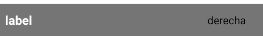

### LIST HEADER

Este componente permite añadir elementos para mostrar diferente información y aplicar acciones al componente.

```jsx
<ListHeader label={'label'}
			textColor={'#000000'}
			rightItem={() => <Text style={{marginRight: 16}}>derecha</Text>}
			style={{backgroundColor: '#FF0000'}}/>
```


**Propiedades**
-

**`label ( required )`**

Define el título que va a tener el componente.
<br>
Recibe un `string`
```jsx
<ListHeader label={'label'}/>
```


**`textColor ( optional )`**

Define los estilos que va a tener el título del componente.
<br>
Recibe un `string`
```jsx
<ListHeader label={'label'} textColor={'#000000'}/>
```


<div style="page-break-after: always;"></div>

**`rightItem ( optional )`**

Renderiza un componente a la derecha del componente.
<br>
Recibe una `function` que devuelve un `component`
```jsx
<ListHeader label={'label'}
			rightItem={() => <Text style={{marginRight: 16}}>derecha</Text>}/>
```


**`style ( optional )`**

Añade estilos directamente al componente.
<br>
Recibe un `View.style`
- No se pueden cambiar los estilos del label
- No se pueden cambiar los estilos del elemento `rightItem`

<div style="page-break-after: always;"></div>