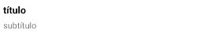

### LIST ITEM

Este componente permite añadir elementos para mostrar diferente información y aplicar acciones al componente.

```jsx
<ListItem title={'título'} 
		  subtitle={'subtítulo'}
		  rightItem={() => <Text style={{marginRight: 16}}>derecha</Text>}
		  onClick={() => alert('elemento pulsado')}
		  onLongClick={() => alert('elemento mantenido')}
		  style={{backgroundColor: #FF6666'}}/>
```


**Propiedades**
-

**`title ( required )`**

Define el título que va a tener el componente.
<br>
Recibe un `string`
```jsx
<ListItem title={'título'}/>
```


**`titleStyles ( optional )`**

Define los estilos que va a tener el título del componente.
<br>
Recibe un `View.style`
```jsx
<ListItem title={'título'} titleStyles={{color: '#FF0000'}}/>
```


<div style="page-break-after: always;"></div>

**`subtitle ( optional )`**

Define el subtítulo que va a tener el componente. Puede ser una pequeña descripción.
<br>
Recibe un `string`
```jsx
<ListItem title={'título'} subtitle={'subtítulo'}/>
```


**`rightItem ( optional )`**

Renderiza un componente a la derecha del componente.
<br>
Recibe una `function` que devuelve un `component`
```jsx
<ListItem title={'título'}
		  rightItem={() => <Text style={{marginRight: 16}}>derecha</Text>}/>
```


**`feedback ( optional )`**

Especifica si el componente muestra un feedkback o no cuando se pulsa. El feedback es un efecto de opacidad.
<br>
Recibe un `bool`. Por defecto el valor es `true`

**`onClick ( optional )`**

Función llamada cuando el usuario pulsa el componente.
```jsx
<ListItem title={'título'} onClick={() => alert('elemento pulsado')}/>
```

**`onLongClick ( optional )`**

Función llamada cuando el usuario mantiene pulsado el componente.
```jsx
<ListItem title={'título'} onLongClick={() => alert('elemento mantenido')}/>
```

<div style="page-break-after: always;"></div>

**`style ( optional )`**

Añade estilos directamente al componente.
<br>
Recibe un `View.style`
- No se pueden cambiar los estilos del subtítulo
- No se pueden cambiar los estilos del elemento `rightItem`

<div style="page-break-after: always;"></div>