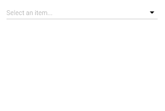
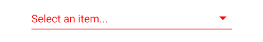

### PICKER

Este componente añade una capa controladora al componente [React Native Picker Select](https://www.npmjs.com/package/react-native-picker-select).

```jsx
<Picker initialValue={'2'}
		data={[
			{label: 'elemento 1', value: '1', color: 'red'},
			{label: 'elemento 2', value: '2', color: 'green'},
			{label: 'elemento 3', value: '3'}
		]}
		placeholder={'Selecciona un elemento...'}
		onValueChange={(value) => alert('valor: ' + value)}/>
```


**Propiedades**
-

**`data ( required )`**

Define los elementos que se van a mostrar en el componente.
<br>
Recibe un `array` de `object` => `{ label: String, value: String, color : String }`
```jsx
<Picker data={[
			{label: 'elemento 1', value: '1', color: 'red'},
			{label: 'elemento 2', value: '2', color: 'green'},
			{label: 'elemento 3', value: '3'}
		]}/>
```



<div style="page-break-after: always;"></div>

- `label` : texto que se va a mostrar (required)
- `value` : valor que tiene el elemento (required)
- `color` : indica el color de texto del `label` (optional)

**`initialValue ( optional )`**

Define el elemento seleccionado por defecto cuando se monta el componente. Selecciona el elemento cuyo `value` corresponda con esta propiedad.
<br>
Recibe un `string`
```jsx
<Picker data={[
			{label: 'elemento 1', value: '1', color: 'red'},
			{label: 'elemento 2', value: '2', color: 'green'},
			{label: 'elemento 3', value: '3'}
		]}
		initialValue={'2'}/>
```


**`placeholder ( optional )`**

Define el placeholder que tendrá el componente.
<br>
Recibe un `array` de objectos => `{ label: String, value: String, color : String }`
```jsx
<Picker data={[
			{label: 'elemento 1', value: '1', color: 'red'},
			{label: 'elemento 2', value: '2', color: 'green'},
			{label: 'elemento 3', value: '3'}
		]}
		placeholder={'Selecciona un elemento...'}/>
```


<div style="page-break-after: always;"></div>

**`error ( optional )`**

Especifica si el componente tiene que mostrar un error o no.
<br>
Recibe un `bool`. Por defecto es valor es `false`
```jsx
<Picker data={[
			{label: 'elemento 1', value: '1', color: 'red'},
			{label: 'elemento 2', value: '2', color: 'green'},
			{label: 'elemento 3', value: '3'}
		]}
		error={true}/>
```


**`enabled ( optional )`**

Indica si el componente está habilitado o no.
<br>
Recibe un `bool`. Por defecto es valor es `false`

**`onValueChange ( optional )`**

Función llamada cuando el elemento seleccionado cambia.
<br>
Recibe un parámetro `value : String` que indica el nuevo valor del componente (propiedad `value` del objecto `data`)
```jsx
<Picker data={[
			{label: 'elemento 1', value: '1', color: 'red'},
			{label: 'elemento 2', value: '2', color: 'green'},
			{label: 'elemento 3', value: '3'}
		]}
		onValueChange={(value) => alert('valor: ' + value)}/>
```

**`style ( optional )`**

Añade estilos directamente al componente.
<br>
Recibe un `View.style`
- No se pueden aplicar estilos a los elementos del componente
- No se pueden cambiar los estilos del error
- No se puede cambiar el diálogo de selección

<div style="page-break-after: always;"></div>