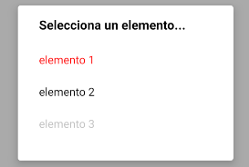
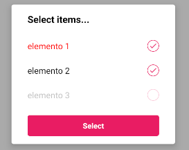

### PICKER

Este componente permite al usuario seleccionar uno o más elementos de entre varios.

```jsx
<Picker initialValue={'2'} placeholder={'Selecciona un elemento...'}
		data={[
			{label: 'elemento 1', value: '1', color: 'red'},
			{label: 'elemento 2', value: '2'},
			{label: 'elemento 3', value: '3', disabled: true}
		]}
		onValueChange={(value) => alert('valor: ' + value)}/>
```



**Propiedades**
-

**`data ( required )`**

Define los elementos que se van a mostrar en el componente.
<br>
Recibe un `array` de `object` => `{ label: String, value: String, color : String }`

- `label` : texto que se va a mostrar (required)
- `value` : valor que tiene el elemento (required)
- `color` : indica el color de texto del `label` (optional)
- `disabled` : indica si el elemento es clickable o no (optional)

<div style="page-break-after: always;"></div>

```jsx
<Picker data={[
			{label: 'elemento 1', value: '1', color: 'red'},
			{label: 'elemento 2', value: '2'},
			{label: 'elemento 3', value: '3', disabled: true}
		]}/>
```


**`initialValue ( optional )`**

Define el elemento seleccionado por defecto cuando se monta el componente. Selecciona el elemento cuyo `value` corresponda con esta propiedad.
<br>
Recibe un `string`
```jsx
<Picker data={[
			{label: 'elemento 1', value: '1', color: 'red'},
			{label: 'elemento 2', value: '2'},
			{label: 'elemento 3', value: '3', disabled: true}
		]}
		initialValue={'2'}/>
```


&#9888; Si `multiple = true`, entonces la propiedad recibe  un `Array[string]`
```jsx
<Picker data={[
			{label: 'elemento 1', value: '1', color: 'red'},
			{label: 'elemento 2', value: '2'},
			{label: 'elemento 3', value: '3', disabled: true}
		]}
		multiple={true}
		initialValue={['1','2']}/>
```


**`placeholder ( optional )`**

Define el placeholder que tendrá el componente. También hace la función de título del diálogo.
<br>
Recibe un `string`
```jsx
<Picker data={[
			{label: 'elemento 1', value: '1', color: 'red'},
			{label: 'elemento 2', value: '2'},
			{label: 'elemento 3', value: '3', disabled: true}
		]}
		placeholder={'Selecciona un elemento...'}/>
```


**`error ( optional )`**

Especifica si el componente tiene que mostrar un error o no.
<br>
Recibe un `bool`. Por defecto es valor es `false`
```jsx
<Picker data={[
			{label: 'elemento 1', value: '1', color: 'red'},
			{label: 'elemento 2', value: '2'},
			{label: 'elemento 3', value: '3', disabled: true}
		]}
		error={true}/>
```


<div style="page-break-after: always;"></div>

**`multiple ( optional )`**

Indica si el componente permite seleccionar varios elementos o no.
<br>
Recibe un `bool`. Por defecto el valor es `false`
```jsx
<Picker data={[
			{label: 'elemento 1', value: '1', color: 'red'},
			{label: 'elemento 2', value: '2'},
			{label: 'elemento 3', value: '3', disabled: true}
		]}
		multiple={true} initialValue={['1', '2']}/>
```


**`textExit ( optional )`**

Indica el texto del botón cuando `multiple = true`.
<br>
Recibe un `string`
```jsx
<Picker data={[
			{label: 'elemento 1', value: '1', color: 'red'},
			{label: 'elemento 2', value: '2'},
			{label: 'elemento 3', value: '3', disabled: true}
		]}
		textExit={'Seleccionar'} multiple={true} initialValue={['1', '2']}/>
```


<div style="page-break-after: always;"></div>

**`disabled ( optional )`**

Indica si el componente está deshabilitado o no.
<br>
Recibe un `bool`. Por defecto es valor es `false`

**`onValueChange ( optional )`**

Función llamada cuando el elemento seleccionado cambia.
<br>
Recibe un parámetro `value : String` que indica el nuevo valor del componente (propiedad `value` del objecto `data`)
```jsx
<Picker data={[
			{label: 'elemento 1', value: '1', color: 'red'},
			{label: 'elemento 2', value: '2'},
			{label: 'elemento 3', value: '3', disabled: true}
		]}
		onValueChange={(value) => alert('valor: ' + value)}/>
```

**`style ( optional )`**

Añade estilos directamente al componente.
<br>
Recibe un `View.style`
- No se pueden aplicar estilos a los elementos del componente
- No se pueden cambiar los estilos del error
- No se puede cambiar el diálogo de selección
- No se puede cambiar los estilos del botón de seleccionar cuando `multiple = true`

<div style="page-break-after: always;"></div>