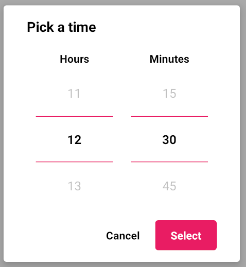
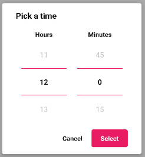

### TIME PICKER

Este componente permite al usuario seleccionar una hora y minutos.

&#9888; **IMPORTANTE**
<br>
Si se quiere modificar las propiedades `initialHours` y `initialMinutes` de este componente en tiempo de ejecución, será necesario desmontar el componente y volver a montarlo.
<br>
Así sería una posible implementación
```jsx
<Button label={'Mostrar diálogo'} onClick={() => this.setState({visible: true})}/>

{this.state.visible && 
<TimePicker onCancel={() => console.log('cancelado')}
			onSubmit={(hours, minutes) => alert(`${hours}:${minutes}`)}
			initialHours={12} initialMinutes={30}/>
}
```


**Propiedades**
-

**`onSubmit, onCancel ( required )`**

- **onSubmit**<br>
Función llamada cuando el usuario acepta el diálogo.
<br>
Recibe dos parámetros `hours : Number , minutes : Number/String` que representan la hora y minutos seleccionados.

- **onCancel**<br>
Función llamada cuando el usuario cancela el diálogo.

```jsx
<TimePicker onCancel={() => console.log('cancelado')}
			onSubmit={(hours, minutes) => console.log(hours, minutes)}
/>
```

<div style="page-break-after: always;"></div>

**`initialHours ( optional )`**

Indica la hora inicial seleccionada del componente.
<br>
Recibe un `number`. Los valores posibles son `[0-23]`. Por defecto el valor es `0`
```jsx
<TimePicker onCancel={() => console.log('cancelado')}
			onSubmit={(hours, minutes) => alert(hours, minutes)}
			initialHours={12}/>
```


**`initialMinutes ( optional )`**

Indica los minutos iniciales seleccionados del componente.
<br>
Recibe un `number`. Los valores posibles son `[0, 15, 30, 45]`. Por defecto el valor es `0`
```jsx
<TimePicker onCancel={() => console.log('cancelado')}
			onSubmit={(hours, minutes) => alert(hours, minutes)}
			initialMinutes={30}/>
```


<div style="page-break-after: always;"></div>