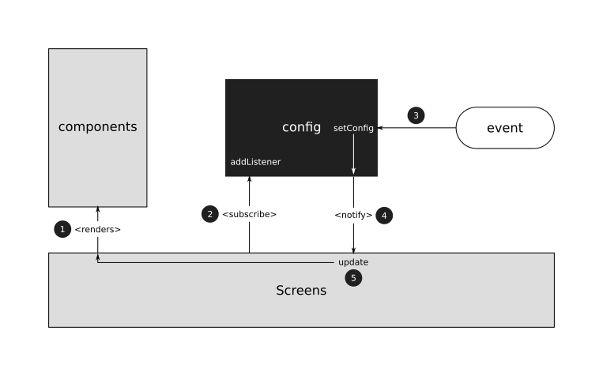

### CONFIG

El i18n es un controlador creado para manejar qué idiomas tiene la aplicación y qué idioma tiene seleccionado la aplicación.

**Cómo funciona**

Para una mejor experiencia de usuario, se puede confiruar ciertas partes de la aplicación, como la información mostrada en el calendario.
 
En el caso de que sea la primera vez que se abra la aplicación, este módulo cargará automáticamente una configuración por defecto que activará todo.

Aquí se muestra una imagen con el diagrama de cómo funciona dentro de la aplicación.

El funcionamiento de este sistema es igual que el sistema de [i18n](diagram_i18n.md).
 
La mayor diferencia es que aquí no hace falta suscribir todas las pantallas al sistema, sólo aquellas que se puedan ver afectadas por el cambio. En nuestro caso sólo es la pantalla Calendario.

Igual que con el i18n, la configuración se guarda automáticamente en la memoria local del dispositivo.

