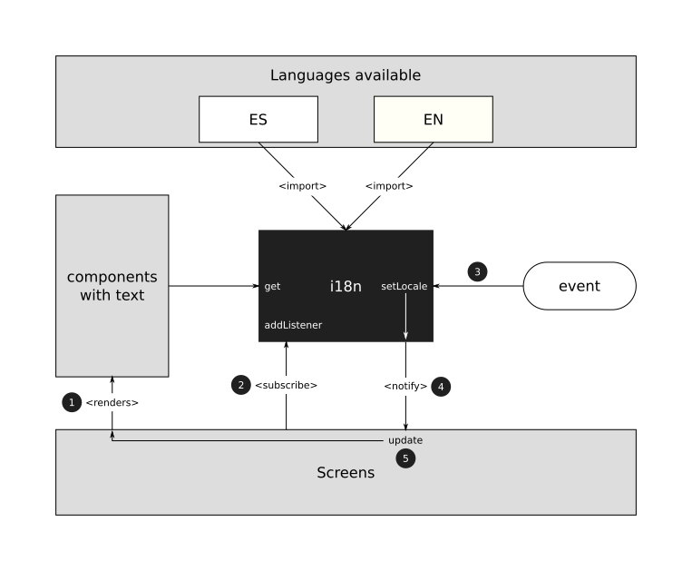

### I18N

El i18n es un controlador creado para manejar qué idiomas tiene la aplicación y qué idioma tiene seleccionado la aplicación.

**¿Por qué i18n?**

La nomenclatura de i18n viene de `Internationalization`, I - 18 letras - N.

**Cómo funciona**

Para una mejor experiencia de usuario, el i18n permite modificar el idioma de la aplicación desde la pantalla de ajustes.
 
En el caso de que sea la primera vez que se abra la aplicación, este módulo detectará automáticamente el idioma del dispositivo y seleccionará entre `español` (si tu dispositivo tiene configurado algún idioma derivado del español) o `inglés` en cualquier otro caso.

Aquí se muestra una imagen con el diagrama de cómo funciona dentro de la aplicación.

Podemos distinguir 4 bloques principales:
- **i18n** : es el controlador en sí
- **Screens** : todas las pantallas de la aplicación
- **Components** : todos los componentes que tengan un contenido estático, y que por consiguiente tengan que mostrar dicho texto en un idioma o en otro
- **Languages available** : idiomas disponibles en la aplicación

También podemos ver que a la derecha hay un componente llamado **evento**. Este componente indica al i18n que tiene que cambiar de idioma.

El flujo que sigue este diagrama comienza con la renderización del componente (1).
- Lo primero que hacen las pantallas es renderizar todo su contenido en la pantalla.
- Acto seguido se ejecuta una función llamada `componentDidMount`. Dentro de esta función (sólo en las pantallas), se añade un `listener` al i18n. Básicamente suscribe a la pantalla para que sea notificada cuando haya algún cambio.
- Este comportamiento se produce en el punto 3, cuando un evento hace que se tenga que actualizar el idioma de la aplicación, con la función `setLocale`.
- Esto nos lleva al punto 4, donde se notifica a todas las pantallas que se hayan suscrito al i18n (paso 2), para forzar una actualización en sus vistas (5).
- Una vez que se ha llegado al punto 5, el ciclo se cierra, volviendo al apartado 1. En este caso, la suscripción al i18n no vuelve a ocurrir ya que la pantalla no se desrenderiza.

Con este sistema, podemos actualizar el idioma de toda la aplicación sin necesidad de reiniciar la aplicación.

Esta configuración se guarda automáticamente en la memoria local del dispositivo, para preservar el idioma.

