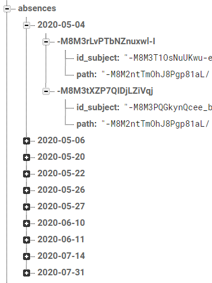
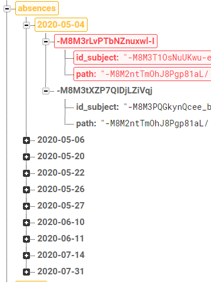

## TEST EXAMS

Input test
-

<table>
<tr>
<td style="vertical-align: top">

</td>
<td style="vertical-align: top">
Si se intenta guardar unas vacaciones que no tiene todos los campos rellenos, se mostrará un error en pantalla

No es obligatorio especificar las clases que ocupa el examen
</td>
</tr>
<tr>
<td style="vertical-align: top">

</td>
<td style="vertical-align: top">
Si ya existe otro examen ese día y tiene alguna clase seleccionada, no permitirá seleccionar las horas ocupadas
</td>
</tr>
</table>

Añadir examen
-

<table style="width: 100%">
<tr><th>Premisa</th><th>Esperado</th></tr>
<tr>
<td style="vertical-align: top; width: 50%">
Añadir un examen con los datos:
<pre>
date: '2020-05-04'
id_subject: -M8M35u5sszS3YsSSpf4
schedules: {
	0
	1
}
</pre>
<code>id_subject</code> corresponde con la asignatura
<pre>
'Acceso A Datos'
</pre>
Los valores <code>0, 1</code> representan las clases que ocupa el examen
<pre>
Lunes 8:30 - 10:30
Desarrollo De Interfaces 
Lunes 10:30 - 12:30
Desarrollo De Interfaces
</pre>
</td>
<td style="vertical-align: top; width: 50%">
Aparecerá un nuevo nodo con los datos:
<pre>
date: '2020-05-04'
id_subject: -M8M35u5sszS3YsSSpf4
schedules: {
	0
	1
}
</pre>
Se eliminarán las faltas de asistencia de las clases ocupadas:
<pre>
-M8M3rLvPTbNZnuxwl-I
</pre>
</td>
</tr>
</table>

|	Datos iniciales	|	Datos esperados	|	Test	|
|:-:|:-:|:-:|
|		|		|	✔️	|
|		|		|	✔️	|

Actualizar examen
-

<table style="width: 100%">
<tr><th>Premisa</th><th>Esperado</th></tr>
<tr>
<td style="vertical-align: top; width: 50%">
Modificar el examen con los datos:
<pre>
date: '2020-06-25'
id_subject: -M8M35u5sszS3YsSSpf4
</pre>
<code>id_subject</code> corresponde con la asignatura:
<pre>
'Acceso A Datos'
</pre>
cambiándolos a:
<pre>
date: '2020-05-27'
id_subject: -M8M3PQGkynQcee_bC5j
schedules: {
	0
}
</pre>
<code>id_subject</code> corresponde con la asignatura:
<pre>
'Programación Multimedia Y Dispositivos Móviles'
</pre>
El valor <code>0</code> representa la clase que ocupa el examen
<pre>
Miércoles 12:30 - 14:30
Acceso A Datos
</pre>
</td>
<td style="vertical-align: top; width: 50%">
Se modificará el nodo con los nuevos datos:
<pre>
date: '2020-05-27'
id_subject: -M8M3PQGkynQcee_bC5j
schedules: {
	0
}
</pre>
Se eliminarán las faltas de asistencia de las clases ocupadas:
<pre>
-M8M48GIDflDh4Uf5e5l
</pre>
</td>
</tr>
</table>

|	Datos iniciales	|	Datos esperados	|	Test	|
|:-:|:-:|:-:|
|		|		|	✔️	|
|		|		|	✔️	|

Eliminar examen
-

<table style="width: 100%">
<tr><th>Premisa</th><th>Esperado</th></tr>
<tr>
<td style="vertical-align: top; width: 50%">
Eliminar el examen con los datos:
<pre>
date: '2020-05-28'
id_subject: -M8M3PQGkynQcee_bC5j
schedules: {
	0
	1
}
</pre>
<code>id_subject</code> corresponde con la asignatura:
<pre>
'Programación Multimedia Y Dispositivos Móviles'
</pre>
Los valores <code>0, 1</code> representan las clases que ocupa el examen
<pre>
Jueves 8:30 - 10:30
Acceso A Datos 
Jueves 10:30 - 12:30
Sistemas De Gestión Empresarial
</pre>
</td>
<td style="vertical-align: top; width: 50%">
Se eliminará el nodo con los datos:
<pre>
date: '2020-05-28'
id_subject: -M8M3PQGkynQcee_bC5j
schedules: {
	0
	1
}
</pre>
</td>
</tr>
</table>

|	Datos iniciales	|	Datos esperados	|	Test	|
|:-:|:-:|:-:|
|		|		|	✔️	|

