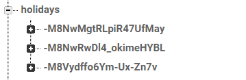
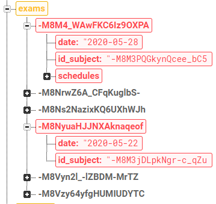
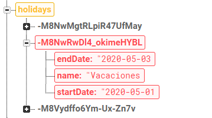

## TEST HOLIDAYS

Añadir vacaciones
-

<table style="width: 100%">
<tr><th>Premisa</th><th>Esperado</th></tr>
<tr>
<td style="vertical-align: top; width: 50%">
Añadir unas vacaciones con los datos:
<pre>
endDate: '2020-05-28'
name: 'Vacaciones'
startDate: '2020-05-19'
</pre>
</td>
<td style="vertical-align: top; width: 50%">
Aparecerá un nuevo nodo con los datos:
<pre>
endDate: '2020-05-28'
name: 'Vacaciones'
startDate: '2020-05-19'
</pre>
Se eliminarán todas las faltas de asistencia entre esos días
<pre>
-M8M43hlRy0MLITYZRh3
-M8M4KNMzOwQYr69abNy
-M8M4OXNi0202P10Oy2i
-M8M3z83kkPB4JMfd3pu
-M8M48GIDflDh4Uf5e5l
</pre>
Se eliminarán todos los exámenes entre esos días
<pre>
-M8M4_WAwFKC6Iz9OXPA
-M8NrwZ6A_CFqKuglbS-
</pre>
</td>
</tr>
</table>

|	Datos iniciales	|	Datos esperados	|	Test	|
|:-:|:-:|:-:|
|		|		|	✔️	|
|		|		|	✔️	|
|		|		|	✔️	|

Actualizar vacaciones
-

<table style="width: 100%">
<tr><th>Premisa</th><th>Esperado</th></tr>
<tr>
<td style="vertical-align: top; width: 50%">
Modificar unas vacaciones con los datos:
<pre>
endDate: '2020-05-01'
name: 'Vacaciones'
startDate: '2020-05-03'
</pre>
cambiándolos a:
<pre>
endDate: '2020-05-01'
name: 'Holidays Updated'
startDate: '2020-05-05'
</pre>
</td>
<td style="vertical-align: top; width: 50%">
Se modificará el nodo con los nuevos datos:
<pre>
endDate: '2020-05-01'
name: 'Holidays Updated'
startDate: '2020-05-05'
</pre>
Se eliminarán todas las faltas de asistencia entre esos días
<pre>
-M8M3rLvPTbNZnuxwl-I
-M8M3tXZP7QIDjLZiVqj
</pre>
Se eliminarán todos los exámenes entre esos días
</td>
</tr>
</table>

|	Datos iniciales	|	Datos esperados	|	Test	|
|:-:|:-:|:-:|
|		|		|	✔️	|
|		|		|	✔️	|

Eliminar vacaciones
-

<table style="width: 100%">
<tr><th>Premisa</th><th>Esperado</th></tr>
<tr>
<td style="vertical-align: top; width: 50%">
Eliminar las vacaciones con los datos:
<pre>
endDate: '2020-05-01'
name: 'Vacaciones'
startDate: '2020-05-03'
</pre>
</td>
<td style="vertical-align: top; width: 50%">
Se eliminará el nodo con los datos:
<pre>
endDate: '2020-05-01'
name: 'Vacaciones'
startDate: '2020-05-03'
</pre>
</td>
</tr>
</table>

|	Datos iniciales	|	Datos esperados	|	Test	|
|:-:|:-:|:-:|
|		|		|	✔️	|

