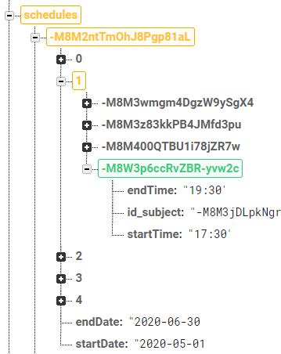
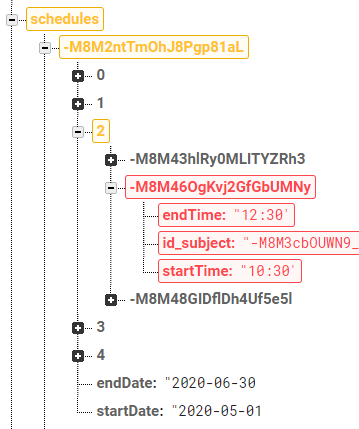
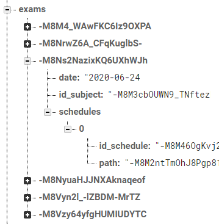

## TEST ABSENCES

Input test
-

<table>
<tr>
<td style="vertical-align: top">

</td>
<td style="vertical-align: top">
Si se intenta guardar unas vacaciones que no tiene todos los campos rellenos, se mostrará un error en pantalla
</td>
</tr>
<tr>
<td style="vertical-align: top">

</td>
<td style="vertical-align: top">
Si ya existe una clase que ocupa las horas elegidas o parte de ellas, se mostrará un error en pantalla
</td>
</tr>
<tr>
<td style="vertical-align: top">

</td>
<td style="vertical-align: top">
Las horas elegidas no pueden ser iguales, por lo se mostrará un error en pantalla
</td>
</tr>
</table>

Añadir clase
-

<table style="width: 100%">
<tr><th>Premisa</th><th>Esperado</th></tr>
<tr>
<td style="vertical-align: top; width: 50%">
Añadir una clase el martes con los datos:
<pre>
-M8V9HxcOPUM6qsydL4c: {
endTime: '19:30'
id_subject: -M8M3jDLpkNgr-c_qZui
startTime: '17:30'
}
</pre>
<code>id_subject</code> corresponde con la asignatura:
<pre>
Sistemas De Gestión Empresarial
</pre>
</td>
<td style="vertical-align: top; width: 50%">
Aparecerá un nuevo nodo el martes con los datos:
<pre>
-M8V9HxcOPUM6qsydL4c: {
endTime: '19:30'
id_subject: -M8M3jDLpkNgr-c_qZui
startTime: '17:30'
}
</pre>
</td>
</tr>
</table>

|	Datos iniciales	|	Datos tras actualización	|	Test	|
|:-:|:-:|:-:|
|		|		|	✔️	|

Actualizar clase
-

<table style="width: 100%">
<tr><th>Premisa</th><th>Esperado</th></tr>
<tr>
<td style="vertical-align: top; width: 50%">
Modificar una clase el jueves con los datos:
<pre>
-M8M4FZOyJQquzOQY9Tj: {
endTime: '12:30'
id_subject: -M8M3jDLpkNgr-c_qZui
startTime: '10:30'
}
</pre>
<code>id_subject</code> corresponde con la asignatura:
<pre>
Sistemas De Gestión Empresarial
</pre>
</td>
<td style="vertical-align: top; width: 50%">
Se modificará el nodo del jueves con los nuevos datos:
<pre>
-M8M4FZOyJQquzOQY9Tj: {
endTime: '16:30'
id_subject: -M8M3PQGkynQcee_bC5j
startTime: '14:30'
}
</pre>
<code>id_subject</code> corresponde con la asignatura:
<pre>
Programación Multimedia Y Dispositivos Móviles
</pre>
</td>
</tr>
</table>

|	Datos iniciales	|	Datos tras actualización	|	Test	|
|:-:|:-:|:-:|
|		|		|	✔️	|

Eliminar clase
-

<table style="width: 100%">
<tr><th>Premisa</th><th>Esperado</th></tr>
<tr>
<td style="vertical-align: top; width: 50%">
Eliminar la clase del miércoles con los datos:
<pre>
-M8M4FZOyJQquzOQY9Tj: {
endTime: '12:30'
id_subject: -M8M3jDLpkNgr-c_qZui
startTime: '10:30'
}
</pre>
<code>id_subject</code> corresponde con la asignatura:
<pre>
Programación de Servicios Y Procesos
</pre>
Se eliminarán las referencias a ese horario de los exámenes:
<pre>
-M8Ns2NazixKQ6UXhWJh
</pre>
Se eliminarán las ausencias en ese horario:
<pre>
-M8M46OgKvj2GfGbUMNy
</pre>
</td>
<td style="vertical-align: top; width: 50%">
Se eliminará el nodo del miércoles con los datos:
<pre>
-M8M4FZOyJQquzOQY9Tj: {
endTime: '12:30'
id_subject: -M8M3jDLpkNgr-c_qZui
startTime: '10:30'
}
</pre>
<code>id_subject</code> corresponde con la asignatura:
<pre>
Programación Multimedia Y Dispositivos Móviles
</pre>
</td>
</tr>
</table>

|	Datos iniciales	|	Datos tras actualización	|	Test	|
|:-:|:-:|:-:|
|		|		|	✔️	|
|		|		|	✔️	|
|		|		|	✔️	|

