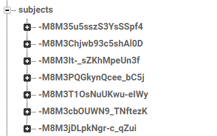
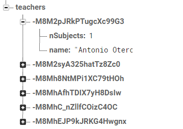
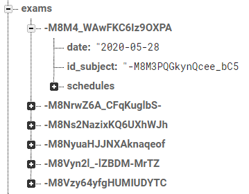
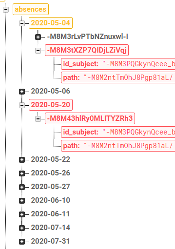

## TEST SUBJECTS

Input test
-

<table>
<tr>
<td style="vertical-align: top">

</td>
<td style="vertical-align: top">
Si se intenta guardar una asignatura que no tiene todos los campos rellenos, se mostrará un error en pantalla
</td>
</tr>
</table>

Añadir asignatura
-

<table style="width: 100%">
<tr><th>Premisa</th><th>Esperado</th></tr>
<tr>
<td style="vertical-align: top; width: 50%">
Añadir una nueva asignatura con los datos:
<pre>
color: '#080808'
id_teacher: -M8M2pJRkPTugcXc99G3
name: 'Subject Added'
percentage: 15
</pre>
<code>id_teacher</code> corresponde con el profesor:
<pre>
nSubjects: 1
name: 'Antonio Otero'
</pre>
</td>
<td style="vertical-align: top; width: 50%">
Aparecerá un nuevo nodo con los datos:
<pre>
color: '#080808'
id_teacher: -M8M2pJRkPTugcXc99G3
name: 'Subject Added'
percentage: 15
</pre>
Se incrementará el campo <code>nSubjects</code> del profesor
<pre>
nSubjects: 2
name: 'Antonio Otero'
</pre>
</td>
</tr>
</table>

|	Datos iniciales	|	Datos esperados	|	Test	|
|:-:|:-:|:-:|
|		|		|	✔️	|
|		|		|	✔️	|

Actualizar asignatura
-

<table style="width: 100%">
<tr><th>Premisa</th><th>Esperado</th></tr>
<tr>
<td style="vertical-align: top; width: 50%">
Modificar la asignatura con los datos:
<pre>
color: '#0000FF'
id_teacher: -M8M2syA325hatTz8Zc0
name: 'Empresa e Iniciativa Emprendedora'
percentage: 15
</pre>
<code>id_teacher</code> corresponde con el profesor:
<pre>
nSubjects: 1
name: 'Miguel Salmerón'
</pre>
cambiándolos a:
<pre>
color: '#800080'
id_teacher: -M8MhAfhTDIX7yH8DsIw
name: 'Subject Updated'
percentage: 15
</pre>
<code>id_teacher</code> corresponde con el profesor:
<pre>
nSubjects: 1
name: 'Francisco Javier Cárceles'
</pre>
</td>
<td style="vertical-align: top; width: 50%">
Se modificará el nodo con los nuevos datos:
<pre>
color: '#800080'
id_teacher: -M8MhAfhTDIX7yH8DsIw
name: 'Subject Updated'
percentage: 15
</pre>
Se descrementará el campo <code>nSubjects</code> del profesor anterior
<pre>
nSubjects: 0
name: 'Miguel Salmerón'
</pre>
Se incrementará el campo <code>nSubjects</code> del nuevo profesor
<pre>
nSubjects: 2
name: 'Francisco Javier Cárceles'
</pre>
</td>
</tr>
</table>

|	Datos iniciales	|	Datos esperados	|	Test	|
|:-:|:-:|:-:|
|		|		|	✔️	|
|		|		|	✔️	|

Eliminar asignatura
-

<table style="width: 100%">
<tr><th>Premisa</th><th>Esperado</th></tr>
<tr>
<td style="vertical-align: top; width: 50%">
Eliminar la asignatura con los datos:
<pre>
color: '#FF6F6F'
id_teacher: -M8MhAfhTDIX7yH8DsIw
name: 'Programación Multimedia Y Dispositivos Móviles'
percentage: 15
</pre>
<code>id_teacher</code> corresponde con el profesor:
<pre>
nSubjects: 1
name: 'Francisco Javier Cárceles'
</pre>
</td>
<td style="vertical-align: top; width: 50%">
Se eliminará el nodo con los datos:
<pre>
color: '#FF6F6F'
id_teacher: -M8MhAfhTDIX7yH8DsIw
name: 'Programación Multimedia Y Dispositivos Móviles'
percentage: 15
</pre>
Se descrementará el campo <code>nSubjects</code> del profesor
<pre>
nSubjects: 0
name: 'Francisco Javier Cárceles'
</pre>
Se eliminarán los exámenes asociados a la asignatura
<pre>
-M8M4_WAwFKC6Iz9OXPA
</pre>
Se eliminarán las ausencias asociadas a la asignatura
<pre>
-M8M3tXZP7QIDjLZiVqj
-M8M43hlRy0MLITYZRh3
</pre>
Se eliminará el campo <code>id_subject</code> de las clases asociadas a la asignatura
<pre>
-M8M3tXZP7QIDjLZiVqj
-M8M43hlRy0MLITYZRh3
</pre>
</td>
</tr>
</table>

|	Datos iniciales	|	Datos tras actualización	|	Test	|
|:-:|:-:|:-:|
|		|		|	✔️	|
|		|		|	✔️	|
|		|		|	✔️	|
|		|		|	✔️	|
|		|		|	✔️	|

