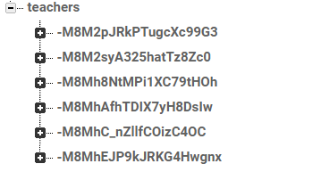
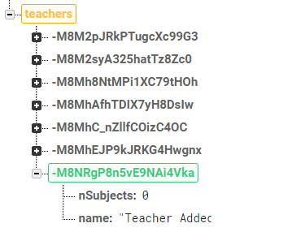
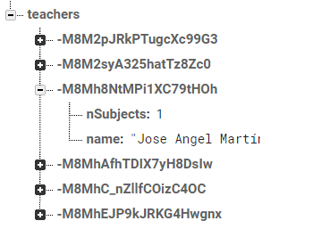
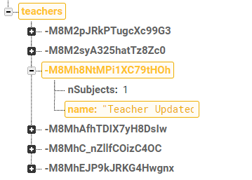
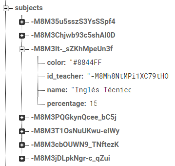
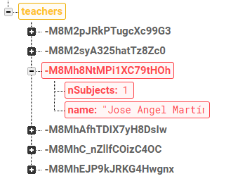
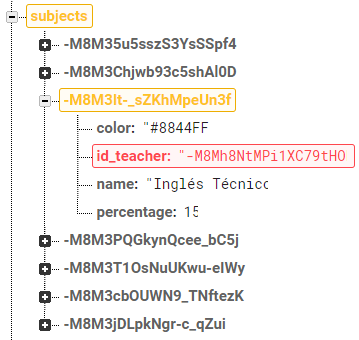

## TEST TEACHERS

Los casos de prueba que se realizan sobre esta funcionalidad son los siguientes:
- Añadir profesor
- Actualizar profesor
- Eliminar profesor

Añadir profesor
-

<table style="width: 100%">
<tr><th>Premisa</th><th>Esperado</th></tr>
<tr>
<td style="vertical-align: top">
Añadir un profesor con los datos:
<pre>
name: 'Teacher Added'
</pre>
</td>
<td style="vertical-align: top">
Aparecerá un nuevo nodo con los datos:
<pre>
nSubjects: 0
name: 'Teacher Added'
</pre>
</td>
</tr>
</table>

|	Datos iniciales	|	Datos tras actualización	|	Test	|
|:-:|:-:|:-:|
|		|		|	✔️	|

Actualizar profesor
-

<table style="width: 100%">
<tr><th>Premisa</th><th>Esperado</th></tr>
<tr>
<td style="vertical-align: top">
Modificar el profesor con los datos:
<pre>
name: 'Jose Angel Martín'
</pre>
cambiándolos a:
<pre>
name: 'Teacher Updated'
</pre>
</td>
<td style="vertical-align: top">
Se modificará el nodo con los nuevos datos:
<pre>
name: 'Teacher Updated'
</pre>
</td>
</tr>
</table>

|	Datos iniciales	|	Datos tras actualización	|	Test	|
|:-:|:-:|:-:|
|		|		|	✔️	|

Eliminar profesor
-

<table style="width: 100%">
<tr><th>Premisa</th><th>Esperado</th></tr>
<tr>
<td style="vertical-align: top">
Eliminar el profesor con los datos:
<pre>
name: 'Jose Angel Martín'
</pre>
</td>
<td style="vertical-align: top">
Se eliminará el nodo con los datos:
<pre>
nSubjects: 1
name: 'Jose Angel Martín'
</pre>
y se eliminará el valor `id_teacher` de la asignatura con datos:
<pre>
color: '#8844FF'
id_teacher: '-M8Mh8NtMPi1XC79tHOh'
name: 'Inglés Técnico'
percentage: 15
</pre>
</td>
</tr>
</table>

|	Datos iniciales	|	Datos tras actualización	|	Test	|
|:-:|:-:|:-:|
|		|		|	✔️	|

