## TEST TIEMTABLES

Input test
-

<table>
<tr>
<td style="vertical-align: top">

</td>
<td style="vertical-align: top">
Si se intenta guardar un horario que no tiene todos los campos rellenos, se mostrará un error en pantalla
</td>
</tr>
<tr>
<td style="vertical-align: top">

</td>
<td style="vertical-align: top">
Si la fecha inicial no es anterior a la fecha final, se mostrará un error en pantalla
</td>
</tr>
</table>

Cada prueba tendrá asociado una representación esquemática de cómo afecta a los diferentes horarios de la aplicación.

Originalmente tenemos dos horarios

Añadir horario
-

<table style="width: 100%">
<tr><th>Premisa</th><th>Esperado</th></tr>
<tr>
<td style="vertical-align: top; width: 50%">
Añadir un horario con los datos:
<pre>
endDate: '2020-08-31'
startDate: '2020-08-01'
</pre>
</td>
<td style="vertical-align: top; width: 50%">
Aparecerá un nuevo nodo con los datos:
<pre>
endDate: '2020-08-31'
startDate: '2020-08-01'
</pre>
</td>
</tr>
</table>

|	Datos iniciales	|	Datos esperados	|	Test	|
|:-:|:-:|:-:|
|		|		|	✔️	|

<table style="width: 100%">
<tr><th>Premisa</th><th>Esperado</th></tr>
<tr>
<td style="vertical-align: top; width: 50%">
Añadir un horario con los datos:
<pre>
endDate: '2020-08-31'
startDate: '2020-08-10'
</pre>
</td>
<td style="vertical-align: top; width: 50%">
Aparecerá un nuevo nodo con los datos:
<pre>
endDate: '2020-08-31'
startDate: '2020-08-10'
</pre>
Se actualizará el campo <code>endDate</code> del horario anterior:
<pre>
endDate: '2020-08-09'
startDate: '2020-07-01'
</pre>
</td>
</tr>
</table>

|	Datos iniciales	|	Datos esperados	|	Test	|
|:-:|:-:|:-:|
|		|	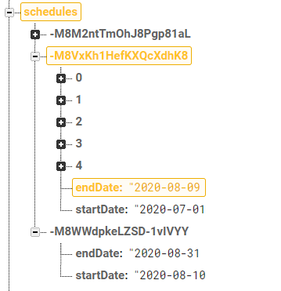	|	✔️	|

<table style="width: 100%">
<tr><th>Premisa</th><th>Esperado</th></tr>
<tr>
<td style="vertical-align: top; width: 50%">
Añadir un horario con los datos:
<pre>
endDate: '2020-08-31'
startDate: '2020-07-10'
</pre>
</td>
<td style="vertical-align: top; width: 50%">
Aparecerá un nuevo nodo con los datos:
<pre>
endDate: '2020-08-31'
startDate: '2020-07-10'
</pre>
Se actualizará el campo <code>endDate</code> del horario anterior:
<pre>
endDate: '2020-07-09'
startDate: '2020-07-01'
</pre>
Se eliminarán todas las faltas de asistencia entre <code>2020-07-10 - 2020-08-31</code>
<pre>
-M8VxoyFo8FYYvCKPa8L
-M8VyM8HX3s7t-smwqzP
</pre>
Se eliminarán todos los exámenes entre <code>2020-07-10 - 2020-08-31</code>
<pre>
-M8Vyn2l_-lZBDM-MrTZ
</pre>
</td>
</tr>
</table>

|	Datos iniciales	|	Datos esperados	|	Test	|
|:-:|:-:|:-:|
|	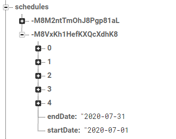	|		|	✔️	|
|		|	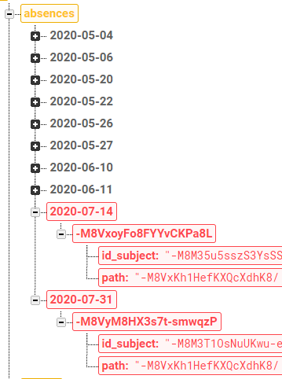	|	✔️	|
|		|		|	✔️	|

<table style="width: 100%">
<tr><th>Premisa</th><th>Esperado</th></tr>
<tr>
<td style="vertical-align: top; width: 50%">
Añadir un horario con los datos:
<pre>
endDate: '2020-08-31'
startDate: '2020-06-25'
</pre>
</td>
<td style="vertical-align: top; width: 50%">
Aparecerá un nuevo nodo con los datos:
<pre>
endDate: '2020-08-31'
startDate: '2020-06-25'
</pre>
Se eliminará el horario:
<pre>
-M8VxKh1HefKXQcXdhK8
</pre>
Se actualizará el campo <code>endDate</code> del horario anterior:
<pre>
endDate: '2020-06-24'
startDate: '2020-05-01'
</pre>
Se eliminarán todas las faltas de asistencia entre <code>2020-06-25 - 2020-08-31</code>
<pre>
-M8VxoyFo8FYYvCKPa8L
-M8VyM8HX3s7t-smwqzP
</pre>
Se eliminarán todos los exámenes entre <code>2020-06-25 - 2020-08-31</code>
<pre>
-M8NrwZ6A_CFqKuglbS-
-M8Vyn2l_-lZBDM-MrTZ
</pre>
</td>
</tr>
</table>

|	Datos iniciales	|	Datos esperados	|	Test	|
|:-:|:-:|:-:|
|	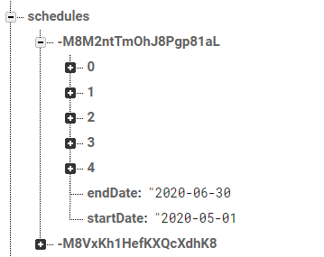	|		|	✔️	|
|		|		|	✔️	|
|	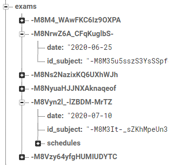	|		|	✔️	|

Actualizar horario
-

<table style="width: 100%">
<tr><th>Premisa</th><th>Esperado</th></tr>
<tr>
<td style="vertical-align: top; width: 50%">
Modificar el horario con los datos:
<pre>
endDate: '2020-06-30'
startDate: '2020-05-01'
</pre>
cambiándolos a:
<pre>
endDate: '2020-07-24'
startDate: '2020-05-01'
</pre>
</td>
<td style="vertical-align: top; width: 50%">
Se modificará el nodo con los nuevos datos:
<pre>
endDate: '2020-07-24'
startDate: '2020-05-01'
</pre>
Se actualizará el campo <code>startDate</code> del horario posterior:
<pre>
endDate: '2020-07-31'
startDate: '2020-07-25'
</pre>
Se eliminarán todas las faltas de asistencia entre <code>2020-07-01 - 2020-07-24</code>
<pre>
-M8VxoyFo8FYYvCKPa8L
</pre>
Se eliminarán todos los exámenes entre <code>2020-07-01 - 2020-07-24</code>
<pre>
-M8Vyn2l_-lZBDM-MrTZ
</pre>
</td>
</tr>
</table>

|	Datos iniciales	|	Datos esperados	|	Test	|
|:-:|:-:|:-:|
|		|		|	✔️	|
|	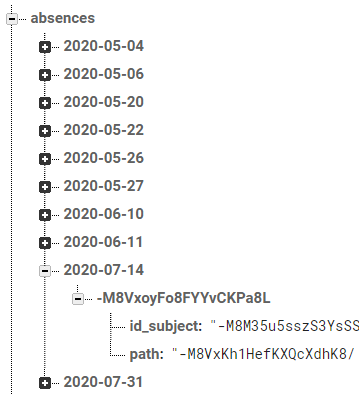	|		|	✔️	|
|		|		|	✔️	|

<table style="width: 100%">
<tr><th>Premisa</th><th>Esperado</th></tr>
<tr>
<td style="vertical-align: top; width: 50%">
Modificar el horario con los datos:
<pre>
endDate: '2020-07-31'
startDate: '2020-07-01'
</pre>
cambiándolos a:
<pre>
endDate: '2020-07-31'
startDate: '2020-06-09'
</pre>
</td>
<td style="vertical-align: top; width: 50%">
Se modificará el nodo con los nuevos datos:
<pre>
endDate: '2020-07-31'
startDate: '2020-06-09'
</pre>
Se actualizará el campo <code>endDate</code> del horario posterior:
<pre>
endDate: '2020-06-08'
startDate: '2020-05-01'
</pre>
Se eliminarán todas las faltas de asistencia entre <code>2020-06-09 - 2020-06-30</code>
<pre>
-M8M46OgKvj2GfGbUMNy
-M8M4FZOyJQquzOQY9Tj
</pre>
Se eliminarán todos los exámenes entre <code>2020-06-09 - 2020-06-30</code>
<pre>
-M8Ns2NazixKQ6UXhWJh
-M8NrwZ6A_CFqKuglbS-
</pre>
</td>
</tr>
</table>

|	Datos iniciales	|	Datos esperados	|	Test	|
|:-:|:-:|:-:|
|		|		|	✔️	|
|	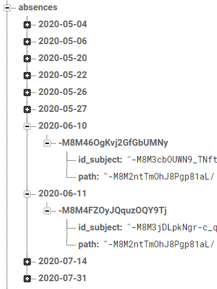	|	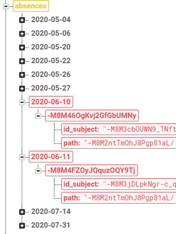	|	✔️	|
|	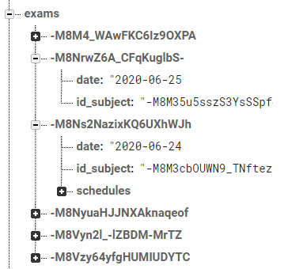	|		|	✔️	|

<table style="width: 100%">
<tr><th>Premisa</th><th>Esperado</th></tr>
<tr>
<td style="vertical-align: top; width: 50%">
Modificar el horario con los datos:
<pre>
endDate: '2020-06-30'
startDate: '2020-05-01'
</pre>
cambiándolos a:
<pre>
endDate: '2020-08-05'
startDate: '2020-05-01'
</pre>
</td>
<td style="vertical-align: top; width: 50%">
Se modificará el nodo con los nuevos datos:
<pre>
endDate: '2020-08-05'
startDate: '2020-05-01'
</pre>
Se eliminará el horario:
<pre>
-M8VxKh1HefKXQcXdhK8
</pre>
Se eliminarán todas las faltas de asistencia entre <code>2020-07-01 - 2020-08-05</code>
<pre>
-M8VxoyFo8FYYvCKPa8L
-M8VyM8HX3s7t-smwqzP
</pre>
Se eliminarán todos los exámenes entre <code>2020-07-01 - 2020-08-05</code>
<pre>
-M8Vyn2l_-lZBDM-MrTZ
</pre>
</td>
</tr>
</table>

|	Datos iniciales	|	Datos esperados	|	Test	|
|:-:|:-:|:-:|
|		|		|	✔️	|
|		|		|	✔️	|
|	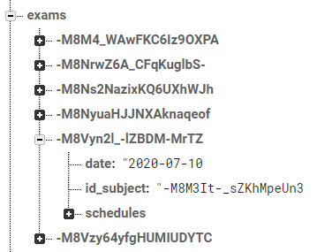	|		|	✔️	|

<table style="width: 100%">
<tr><th>Premisa</th><th>Esperado</th></tr>
<tr>
<td style="vertical-align: top; width: 50%">
Modificar el horario con los datos:
<pre>
endDate: '2020-07-31'
startDate: '2020-07-01'
</pre>
cambiándolos a:
<pre>
endDate: '2020-07-31'
startDate: '2020-04-23'
</pre>
</td>
<td style="vertical-align: top; width: 50%">
Se modificará el nodo con los nuevos datos:
<pre>
endDate: '2020-07-31'
startDate: '2020-04-23'
</pre>
Se eliminará el horario:
<pre>
-M8VxKh1HefKXQcXdhK8
</pre>
Se eliminarán todas las faltas de asistencia entre <code>2020-04-23 - 2020-06-30</code>
<pre>
-M8M3rLvPTbNZnuxwl-I
-M8M3tXZP7QIDjLZiVqj
-M8M48GIDflDh4Uf5e5l
-M8M43hlRy0MLITYZRh3
-M8M4KNMzOwQYr69abNy
-M8M4OXNi0202P10Oy2i
-M8M3z83kkPB4JMfd3pu
-M8M48GIDflDh4Uf5e5l
-M8M46OgKvj2GfGbUMNy
-M8M4FZOyJQquzOQY9Tj
</pre>
Se eliminarán todos los exámenes entre <code>2020-04-23 - 2020-06-30</code>
<pre>
-M8M4_WAwFKC6Iz9OXPA
-M8NrwZ6A_CFqKuglbS-
-M8Ns2NazixKQ6UXhWJh
-M8NyuaHJJNXAknaqeof
-M8Vzy64yfgHUMIUDYTC
</pre>
</td>
</tr>
</table>

|	Datos iniciales	|	Datos esperados	|	Test	|
|:-:|:-:|:-:|
|		|	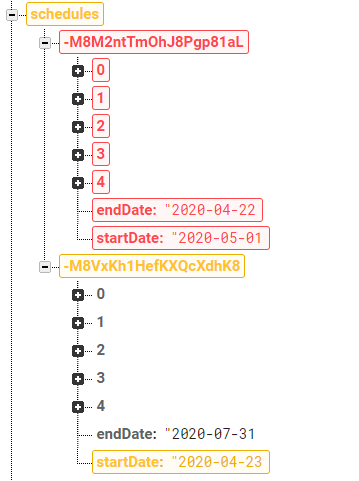	|	✔️	|
|	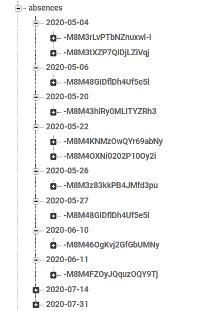	|		|	✔️	|
|	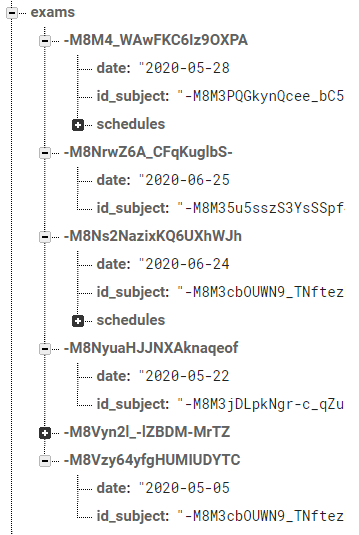	|		|	✔️	|

Eliminar horario
-

<table style="width: 100%">
<tr><th>Premisa</th><th>Esperado</th></tr>
<tr>
<td style="vertical-align: top; width: 50%">
Eliminar el horario con los datos:
<pre>
endDate: '2020-06-30'
startDate: '2020-05-01'
</pre>
</td>
<td style="vertical-align: top; width: 50%">
Se eliminará el nodo con los datos:
<pre>
endDate: '2020-06-30'
startDate: '2020-05-01'
</pre>
Se eliminarán todas las faltas de asistencia entre <code>2020-05-01 - 2020-06-30</code>
<pre>
-M8M3rLvPTbNZnuxwl-I
-M8M3tXZP7QIDjLZiVqj
-M8M48GIDflDh4Uf5e5l
-M8M43hlRy0MLITYZRh3
-M8M4KNMzOwQYr69abNy
-M8M4OXNi0202P10Oy2i
-M8M3z83kkPB4JMfd3pu
-M8M48GIDflDh4Uf5e5l
-M8M46OgKvj2GfGbUMNy
-M8M4FZOyJQquzOQY9Tj
</pre>
Se eliminarán todos los exámenes entre <code>2020-05-01 - 2020-06-30</code>
<pre>
-M8M4_WAwFKC6Iz9OXPA
-M8NrwZ6A_CFqKuglbS-
-M8Ns2NazixKQ6UXhWJh
-M8NyuaHJJNXAknaqeof
-M8Vzy64yfgHUMIUDYTC
</pre>
</td>
</tr>
</table>

|	Datos iniciales	|	Datos esperados	|	Test	|
|:-:|:-:|:-:|
|		|		|	✔️	|
|	Mismas que en el caso de **Update 2**	|	Mismas que en el caso de **Update 2**	|	✔️	|
|	Mismas que en el caso de **Update 2**	|	Mismas que en el caso de **Update 2**	|	✔️	|

<table style="width: 100%">
<tr><th>Premisa</th><th>Esperado</th></tr>
<tr>
<td style="vertical-align: top; width: 50%">
Eliminar el horario con los datos:
<pre>
endDate: '2020-07-31'
startDate: '2020-07-01'
</pre>
</td>
<td style="vertical-align: top; width: 50%">
Se eliminará el nodo con los datos:
<pre>
endDate: '2020-07-31'
startDate: '2020-07-01'
</pre>
Se eliminarán todas las faltas de asistencia entre <code>2020-07-01 - 2020-07-31</code>
<pre>
-M8VxoyFo8FYYvCKPa8L
-M8VyM8HX3s7t-smwqzP
</pre>
Se eliminarán todos los exámenes entre <code>2020-07-01 - 2020-07-31</code>
<pre>
-M8Vyn2l_-lZBDM-MrTZ
</pre>
</td>
</tr>
</table>
</td>
</tr>
</table>

|	Datos iniciales	|	Datos esperados	|	Test	|
|:-:|:-:|:-:|
|		|		|	✔️	|
|	Mismas que en el caso de **Update 3**	|	Mismas que en el caso de **Update 3**	|	✔️	|
|	Mismas que en el caso de **Update 3**	|	Mismas que en el caso de **Update 3**	|	✔️	|

